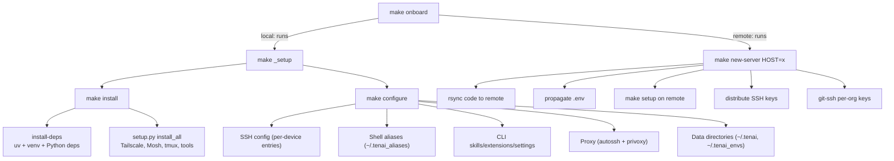

# tenai

[](https://opensource.org/licenses/MIT)
[]()
[]()
[%20%7C%20iOS-lightgrey)]()

Infrastructure-as-code based on Tailscale mesh network. Auto-detects platform (Linux server, macOS, Android/Termux, iOS/iSH, Windows/WSL) and installs + configures everything needed for a multi-device, multi-agent development environment.

## Tech Stack

| Layer | Technology | Purpose |
|-------|-----------|---------|
| **Networking** | [Tailscale](https://tailscale.com) (WireGuard) | Zero-config mesh VPN — device-to-device connectivity |
| **Remote access** | [Mosh](https://mosh.org) + [tmux](https://github.com/tmux/tmux) | Resilient mobile shell + persistent sessions |
| **Proxy** | [autossh](https://www.harding.motd.ca/autossh/) + [privoxy](https://www.privoxy.org/) | Auto-reconnecting SOCKS5 tunnel + HTTP bridge |
| **AI agents** | [Claude Code](https://docs.anthropic.com/en/docs/claude-code) · [Gemini CLI](https://github.com/google-gemini/gemini-cli) · [Codex CLI](https://github.com/openai/codex) | Agentic coding — dispatched to isolated worktrees |
| **Orchestration** | Custom Python (conductor, orchestrator, task DB) | Task generation, dispatch, monitoring, auto-merge |
| **Webapp** | [FastAPI](https://fastapi.tiangolo.com/) + [Docker](https://www.docker.com/) | Web control panel — device dashboard, job launcher |
| **Database** | [SQLite](https://sqlite.org/) (per-device) | Tasks, subtasks, organizations, repos, jobs |
| **Package mgmt** | [uv](https://github.com/astral-sh/uv) | Fast Python venv + package management |
| **Config** | [Hydra](https://hydra.cc/) YAML | Device registry, org/repo settings, CLI config |
| **Linting** | [Ruff](https://github.com/astral-sh/ruff) + [pytest](https://pytest.org/) | Linting and test suite |
| **Shell** | Bash/Zsh aliases, SSH config | 30+ universal functions across all mesh devices |
| **CI** | Webhook listener ([ntfy.sh](https://ntfy.sh/)) + validation pipeline | Automated lint → test → merge on completion |
| **Git isolation** | [Git worktrees](https://git-scm.com/docs/git-worktree) | Parallel agent work without branch conflicts |
| **Browser access** | [VibeTunnel](https://github.com/nicholasgasior/goproxy) (muxtree) | Access tmux sessions through the browser |
| **Platforms** | macOS · Linux · WSL2 · Termux · iSH | Cross-platform with auto-detection (`detect.sh`) |

## Architecture

```
┌────────────────────────────────────────────────────────────┐
│                    Tailscale Mesh VPN                      │
│                                                            │
│  ┌──────────┐  ┌──────────┐  ┌──────────┐  ┌──────────┐   │
│  │ server1  │  │ server2  │  │ laptop   │  │  phone   │   │
│  │ (Linux)  │  │ (Linux)  │  │  (Mac)   │  │(Android) │   │
│  │ webapp   │  │ agents   │  │ conduct  │  │          │   │
│  │ Docker   │  │ dispatch │  │ develop  │  │          │   │
│  └────┬─────┘  └────┬─────┘  └────┬─────┘  └────┬─────┘   │
│       └─────────────┴─────────────┴─────────────┘         │
└────────────────────────────────────────────────────────────┘
```

Each device has its own SQLite database (`~/.tenai/devices/{name}.db`) storing organizations, repos, tasks, subtasks, and jobs. The **webapp** (Docker container on the configured device) provides a web control panel for managing all devices.

> 📖 See [`docs/`](docs/) for detailed guides: [setup](docs/HOWTO_setup.md), [CLI config](docs/HOWTO_cli_setup.md), [conductor](docs/HOWTO_conductor.md), [skills](docs/HOWTO_skills.md), [testing](docs/HOWTO_testing.md), [webapp](docs/HOWTO_webapp.md), [troubleshooting](docs/DEBUG_common_issues.md)

## Capabilities at a Glance

### 🔧 Device Setup & Management
- **One-command setup** — `make onboard` auto-detects platform, registers device, installs everything
- **Remote bootstrap** — `make new-server HOST=x` syncs code, propagates `.env`, installs tools via SSH
- **Code sync** — `make sync HOST=x` rsync + Docker rebuild + alias push, or `make sync-all` for fleet
- **Tool verification** — `make check [HOST=x]` verifies all tools installed across devices
- **Reset device** — `make reset-device` interactive wizard (reset config, walk through `.env` and API keys, optionally full uninstall)
- **Idempotent** — every script is safe to re-run on any platform

### 🤖 AI Agent Orchestration
- **Task generation** — Gemini conductor analyzes codebases, generates ATC-compliant tasks
- **Parallel dispatch** — agents work in isolated git worktrees with auto-approval flags
- **Orchestation loop** — polls DB, dispatches, monitors, marks done, auto-merges (every 30s)
- **Merge safety** — conflict detection, per-worktree validation, integration testing, sequential merge
- **GitHub Issues** — bidirectional sync between task DB and GitHub Issues
- **Webhook triggers** — ntfy.sh notifications for completion and remote dispatch

### 🌐 Web Control Panel
- **Device dashboard** — status, disk, uptime, Docker, tmux sessions
- **Job launcher** — shell commands, conductor sessions, agent dispatch from browser
- **Live monitoring** — real-time tmux session interaction
- **Remote DB sync** — automatically syncs device databases when switching views

### 🔒 Selective Proxy Routing
- **SOCKS5 + HTTP bridge** — route specific CLI tools through Tailscale exit nodes
- **Persistent daemon** — autossh + launchd/systemd for auto-reconnecting tunnel
- **Per-command routing** — `tenai_claude` goes through exit node, `claude` stays direct
- **Network-aware** — macOS `KeepAlive.NetworkState` auto-restarts on Wi-Fi/VPN changes

### 🛠️ CLI Configuration
- **Skills** — reusable agent instructions synced across Claude/Gemini/Codex (`.agents/skills/`)
- **Extensions** — Gemini CLI extensions (MCP servers, tools) with idempotent install
- **Settings** — per-CLI settings merge (`settings.json` management)
- **Rules** — global rules (`CLAUDE.md`, `GEMINI.md`, `AGENTS.md`) deployed to all devices

### 📦 Environment & Config Management
- **Named .env files** — `~/.tenai_envs/{org}--{repo}.env` with push/pull across devices
- **Hydra config** — `config/defaults.yaml` for devices, orgs, repos, proxy, webapp, CI
- **SSH key management** — per-org GitHub SSH keys with automatic git URL rewrites
- **Shell aliases** — 30+ universal functions that work from any directory on any device

## What it installs

| Tool | Purpose |
|------|---------|
| **Tailscale** | Mesh VPN — device-to-device connections |
| **Mosh** | Resilient mobile shell (survives network switches) |
| **tmux** | Persistent terminal sessions with mouse support |
| **uv** | Fast Python package manager (replaces pip) |
| **autossh** | Auto-reconnecting SSH tunnel monitor |
| **privoxy** | HTTP→SOCKS5 protocol bridge for proxy routing |
| **Claude Code** | Agentic coding CLI (Anthropic) |
| **Gemini CLI** | Agentic coding CLI (Google) |
| **Codex CLI** | Agentic coding CLI (OpenAI) |
| **muxtree** | Automated worktree + tmux session manager |
| **VibeTunnel** | Access tmux sessions from browser (private mode) |
| **SSH config** | Pre-configured entries for all tailnet devices |
| **Shell aliases** | Universal functions for the entire mesh |

## Platform requirements

| Platform | Prerequisites | Setup command |
|----------|--------------|:--------------:|
| **macOS** | Homebrew, Git | `make onboard` |
| **Linux** (Ubuntu/Debian) | `apt`, Git | `make onboard` |
| **WSL2** (Windows) | WSL2 installed, Git | `make onboard` |
| **Termux** (Android) | Termux, Git | `make onboard` |
| **Windows native** | — | WSL2 required (see below) |

> **Windows users**: tenai-infra requires WSL2. Run `wsl --install` in PowerShell (Admin), then work inside WSL. For initial device bootstrap (Git, SSH, Tailscale, AI CLIs), you can also run:
> `powershell -File scripts/install/bootstrap_windows.ps1`

### What you need before starting

1. **Tailscale account** — [tailscale.com](https://tailscale.com) (free for personal use)
2. **Tailscale API and AUTH keys** 
   - `TAILSCALE_API_KEY` - for registering devices
   - `TAILSCALE_AUTH_KEY` - for authenticating devices
3. **SSH access** between devices (the setup will configure this)
4. **Git** installed on all devices
5. **API keys** (optional, for AI agent CLIs):
   - `ANTHROPIC_API_KEY` — for Claude Code
   - `GEMINI_API_KEY` — for Gemini CLI
   - `OPENAI_API_KEY` — for Codex CLI
   - `GITHUB_TOKEN` — for GitHub integration

## Quick start

```bash
# 1. Clone on your first device
git clone <repo-url> ~/tenai-infra && cd ~/tenai-infra

# 2. Create your .env with API keys
cp .env.example .env
$EDITOR .env   # set TAILSCALE_AUTH_KEY, TAILSCALE_TAILNET, GITHUB_TOKEN

# 3. Onboard this device (auto-detects platform + installs everything)
make onboard

# 4. Reload shell to activate aliases
source ~/.zshrc   # or source ~/.bashrc on Linux
```

`make onboard` auto-detects your device type, registers it in `config/local.yaml` (gitignored — personal config), and runs the internal `_setup` command (install + configure). Devices added by onboard look like:

```yaml
# config/local.yaml (gitignored — your personal overrides)
tailscale:
  tailnet: yourname@
  devices:
    myserver:               # Added by make onboard
      ip: "100.x.y.z"       # Tailscale IP (auto-detected)
      user: ubuntu           # SSH user
      type: server           # server | mac | android | ios_ish | windows
      capabilities: [conductor, dispatch, claude, gemini]

webapp:
  device: "myserver"        # which device hosts the webapp Docker container
```

Run `make help` to see all available targets.

## Device management

### Setup hierarchy

The setup targets build on each other. Use the one that matches your situation:



| Target | What it does | When to use |
|--------|-------------|-------------|
| `make onboard` | Registers device in config + runs `make _setup` (local) or full remote bootstrap (remote) | **Primary command** — adding a device to the mesh |
| `make install` | Installs uv, Python venv + deps, Tailscale, Mosh, tmux, AI CLIs, autossh, privoxy | Need to install/update tools |
| `make configure` | SSH config, shell aliases, CLI setup, proxy, data dirs | Need to regenerate config after changing `defaults.yaml` |
| `make _setup` | `install` + `configure` (internal full local setup) | Standard underlying setup command |
| `make new-server HOST=x` | Syncs repo via rsync, propagates `.env`, runs `make _setup` on remote, distributes SSH keys, sets up git-ssh | Bootstrap a remote device (called by `make onboard` for remote targets) |
| `make reset-device` | Interactive wizard: backs up config, resets devices, walks through `.env` and tailnet setup. `FULL_RESET=1`: also uninstalls tracked tools. `NONINTERACTIVE=1`: automated/CI mode. | **Recovery** — broken config, or guided setup when unsure what keys to set |

All steps are **idempotent** — safe to re-run at any time.

### Typical first-time workflow

```bash
cp .env.example .env   # 1. Create and fill in your API keys
$EDITOR .env           #    (TAILSCALE_AUTH_KEY, TAILSCALE_TAILNET are required)
make onboard           # 2. Registers this device + runs internal setup
source ~/.zshrc        # 3. Load new aliases (or ~/.bashrc)
```

> **Guided setup**: If you're unsure what keys to set, run `make reset-device` instead — it walks through each key interactively.

For subsequent devices:

```bash
make onboard IP=100.x.y.z                           # remote by IP
make onboard TYPE=server NAME=myserver IP=100.x.y.z  # explicit type + name
make onboard TYPE=android NAME=myandroid             # Android (Termux)
make onboard TYPE=ios NAME=iphone TERMIUS=1          # iOS (Termius)
```

The remote wizard auto-discovers the device on Tailscale, establishes SSH, installs tools, registers it in `config/local.yaml`, and pushes aliases.

#### Shared instances

If the device already has **Tailscale configured by another user**, tenai detects this
and skips Tailscale to avoid disrupting their access (a device can only belong to one
tailnet). To onboard without touching Tailscale:

```bash
make onboard HOST=myhost SKIP_TOOLS=tailscale
```

#### SSH alias resolution

When you specify `HOST=ipm`, the system resolves through: `config/local.yaml` →
`~/.ssh/config` → raw hostname. When resolved from SSH config, the **original alias
is preserved** for all connections, ensuring IdentityFile, ProxyCommand, etc. are
respected.

See [HOWTO_setup.md](docs/HOWTO_setup.md) for shared instances, SSH resolution, and firewall details.

### Resetting a device

To reset your configuration and walk through setup again:

```bash
make reset-device                                  # interactive config reset
make reset-device FULL_RESET=1                      # config reset + uninstall all tracked tools
make reset-device NONINTERACTIVE=1 TAILNET=name@    # automated/CI mode (no prompts)
```

**Config-only reset** (default) backs up `defaults.yaml` and `.env` into `.backup/` (with date suffix, never overwriting existing backups), clears the devices list, and walks through API key setup. It never touches `config/local.yaml` or removes existing backups.

**Full reset** (`FULL_RESET=1`) additionally runs `make uninstall` to surgically reverse all tracked changes — tools, SSH config blocks, aliases, CLI skills — using the state manifest.

To preview what would be removed without changing anything:

```bash
make uninstall DRY_RUN=1    # preview uninstall plan
make state                  # display current state manifest
make state-audit            # reconstruct manifest from filesystem
```

### Sync code to devices

```bash
make sync HOST=myserver           # rsync + rebuild Docker webapp + push aliases + CLI setup
make sync HOST=myserver GIT_PULL=1  # git pull on remote instead
make sync-all                    # sync to all remote devices
```

### Configure local device

```bash
make configure   # SSH config + aliases + CLI skills/extensions/settings + data dirs
```

This is the local equivalent of `make sync`.

## Web control panel

The webapp runs as a Docker container on the device specified in `config/defaults.yaml` under `webapp.device`:

```yaml
webapp:
  device: "server1"    # device that hosts the webapp Docker container
  port: 7700
```

```bash
make sync HOST=myserver     # deploys and auto-rebuilds Docker container if needed
make webapp                 # start locally (foreground)
make webapp-bg              # start in tmux (background)
make webapp-docker          # start in Docker
```

Access at `http://<device-ip>:7700`. Features: device dashboard, org management, repo browser, job launcher (shell, conductor, dispatch), job monitoring with live tmux interaction.

When switching between devices in the webapp, it automatically syncs the remote device's database to ensure fresh data.

## Environment management

Named `.env` files are stored in `~/.tenai_envs/` with the convention `{org}--{repo}.env`:

```bash
# Push .env to a device
make push-env HOST=myserver                    # pushes .env as ~/.tenai_envs/{org--repo}.env
make push-env HOST=myserver ENV_FILE=.env.prod NAME=my-app  # custom file + name

# Sync all env files to devices
make sync-envs HOST=myserver    # single device
make sync-envs                  # all devices

# Pull env into current repo (shell alias — works from any directory)
tenai_env_pull       # prompts before overwriting
tenai_env_pull -f    # force overwrite
```

Worktrees auto-populate `.env` from `~/.tenai_envs/` during setup.

## CLI setup

Skills, extensions, settings, and rules for Claude Code, Gemini CLI, and Codex CLI:

```bash
make cli-setup                     # install all CLI config locally
make cli-setup HOST=myserver       # install on remote device
make cli-setup HOST=all            # install on all devices
make cli-skills HOST=all           # deploy skills only
make cli-extensions CLI=gemini     # extensions for specific CLI
make cli-list                      # list all installed CLI assets
```

Skills live in `.agents/skills/` and are symlinked to each CLI directory. See [HOWTO_skills.md](docs/HOWTO_skills.md) and [HOWTO_cli_setup.md](docs/HOWTO_cli_setup.md).

## Task system & orchestration

Each device has its own SQLite database (`~/.tenai/devices/{name}.db`) storing organizations, repos, tasks, subtasks, and jobs. The **webapp** (Docker container on the configured device) has a separate global DB for device registry and settings. When switching devices in the webapp, it automatically syncs the remote device's database via SCP.

### Task lifecycle

```
create task → dispatch agent → monitor → validate proof → merge
```

### Task management

```bash
make task-add REPO=my-repo TITLE="Fix login bug"          # add a task
make task-list REPO=my-repo                                 # list active tasks
make task-list REPO=my-repo STATUS=completed                # completed tasks
make task-import REPO=my-repo                               # import TASKS.md into DB
make task-import REPO=my-repo HOST=myserver                 # import from remote device
make task-import REPO=my-repo HOST=myserver FORCE=1         # clear + re-import
make task-register REPO=my-repo TITLE="..." CLI=claude      # register + standardize
make task-sync HOST=myserver                                # sync remote task DB to local
make task-delete IDS=1,2,3                                  # delete tasks by ID
make task-query REPO=x PATTERN="auth" SINCE=2026-03-01      # rich query with filters
```

Tasks live in the per-device SQLite DB. `TASKS.md` is an ephemeral view rendered from the DB, not the source of truth.

### Dispatch vs Orchestrate

| | `make dispatch` | `make orchestrate` |
|---|---|---|
| **Scope** | Single task | All active tasks (loop) |
| **Input** | You specify REPO + TASK/BRANCH | Polls DB, TASKS.md, and GitHub Issues |
| **Agent launch** | Creates worktree + starts agent in tmux | Same, but for every dispatchable task |
| **Monitoring** | Manual (`tmux attach`) | Automatic (polls for completion, checks PROOF.md) |
| **Task status** | Manual | Auto-updates DB: active → dispatched → done |
| **TASKS.md** | Unchanged | Re-rendered from DB after each cycle |
| **Merge** | Manual | Auto-runs merge safety pipeline when all agents complete |
| **Notifications** | None | ntfy.sh alerts on completion |
| **Mode** | One-shot | Daemon (runs every 30s until all done) |

### Dispatch (single task)

```bash
make dispatch REPO=my-repo TASK="Fix login" CLI=claude       # local
make dispatch REPO=my-repo TASK="Fix login" HOST=myserver     # remote
make dispatch REPO=my-repo BRANCH=feat/auth CLI=gemini        # explicit branch
```

What dispatch does:
1. Creates a git worktree in `.trees/{branch}/`
2. Copies `.env`, `CLAUDE.md`/`GEMINI.md`/`AGENTS.md`, and `.claude/`/`.gemini/`/`.codex/` dirs
3. Writes `WORKTREE.md` with task instructions
4. Opens a tmux window in the `{repo}-agents` session
5. Launches the CLI with auto-approval flags from `config/cli/{cli}.yaml`:
   - **Claude**: `--dangerously-skip-permissions`
   - **Gemini**: `--yolo`
   - **Codex**: `--full-auto`
6. Sends the agent prompt: "Read WORKTREE.md, implement, test, commit, push, create PROOF.md, exit"

### Orchestrate (automated loop)

```bash
make orchestrate REPO=my-repo                         # dispatch all, monitor, auto-merge
make orchestrate REPO=my-repo CLI=gemini HOST=myserver  # remote, Gemini agents
make orchestrate REPO=my-repo GH_REPO=org/repo         # also pull from GitHub Issues
make orchestrate REPO=my-repo IDS=5,12                  # specific task IDs only
make orchestrate REPO=my-repo PATTERN=auth              # filter by title pattern
make orchestrate REPO=my-repo ONE_SHOT=1                # single pass (no loop)
make orchestrate-webhook                              # listen for ntfy.sh dispatch triggers
```

The orchestrator loop (every 30s):
1. **Load tasks** — DB first, TASKS.md fallback, optionally GitHub Issues
2. **Dispatch** — new active tasks → worktree + agent
3. **Monitor** — check tmux sessions for completion
4. **Mark done** — update DB + TASKS.md when PROOF.md exists
5. **Auto-merge** — when all agents finish: check-conflicts → validate → integration-test → merge-sequential

### Conductor (task generation)

```bash
make conductor REPO=my-repo                   # start Gemini conductor for task planning
make conductor REPO=my-repo HOST=myserver      # on remote device
make conductor-send REPO=my-repo PROMPT="..."  # send prompt to running conductor
```

The conductor is a Gemini session that analyzes a codebase and generates ATC-compliant tasks (Self-Contained, Verifiable, Bounded, Parallelizable, Resume-safe).

### Merge safety pipeline

After agents complete, the merge pipeline validates before merging:

```bash
make check-conflicts REPO=x      # detect file overlap between branches
make validate-worktrees REPO=x   # run tests in every worktree
make integration-test REPO=x     # merge all → test branch → validate
make merge-sequential REPO=x     # merge branches one-by-one with test after each
```

### Monitoring

```bash
make monitor-agents REPO=x HOST=y           # watch agent sessions for completion
make agent-history REPO=x [FORMAT=json]     # session history
```

See [HOWTO_conductor.md](docs/HOWTO_conductor.md), [CONCEPT_agent_system.md](docs/CONCEPT_agent_system.md), and [DATA_FLOW_tasks.md](docs/DATA_FLOW_tasks.md).

## Universal shell aliases

After `make configure`, these functions work from **any directory**:

| Command | Description |
|---------|-------------|
| `<device> [session]` | Mosh into device, attach/create tmux session |
| `ssh_<device>` | Plain SSH to device |
| `send_<device> <file>` | Tailscale file send |
| `tenai_status` | Mesh + repos overview |
| `tenai_check [device]` | Verify tools on device |
| `tenai_devices` | List all mesh devices |
| `tenai_resolve <device>` | IP/user/type lookup |
| `tenai_conductor` | Start conductor session |
| `tenai_dispatch [repo] "title" [cli] [host]` | Launch agent task |
| `tenai_worktree [repo] "title"` | Create git worktree (no agent) |
| `tenai_tmux_worktree [repo] "title" [cli]` | Worktree + tmux + agent |
| `tenai_task_list [repo] [status]` | Query tasks |
| `tenai_task_add [repo] "title" [host]` | Add a task |
| `tenai_push_env <device> [file] [name]` | Push .env to device |
| `tenai_env_pull [-f]` | Pull .env from ~/.tenai_envs/ |
| `tenai_tmux_list [host]` | List tmux sessions (local, remote, or all) |
| `tenai_tmux_clean [host]` | Kill stale tmux sessions (keeps main) |
| `tenai_tmux_kill_all [host]` | Kill ALL tmux sessions (destructive) |
| `tenai_proxy_start [node]` | Start SSH SOCKS5 tunnel (autossh) |
| `tenai_proxy_stop` | Stop tunnel + privoxy |
| `tenai_proxy_status` | Check proxy services |
| `tenai_proxy_test` | Compare real vs proxied IP |
| `tenai_proxy_daemon enable\|disable\|status` | Manage persistent SOCKS5 daemon |

All aliases support `--help`. Commands that accept `repo` auto-detect it from `git remote` when called inside a repo.

## Git SSH key management

```bash
make git-ssh                           # set up all orgs locally
make git-ssh HOST=myserver             # set up on remote (copies your local key)
make git-ssh ORG=myorg HOST=myserver   # single org
make git-ssh HOST=myserver GENERATE_GIT_SSH_KEY=1  # generate new key on device
make distribute-keys                   # distribute SSH keys across all devices
```

Each org gets its own SSH host alias (`github-<org>`) with automatic git URL rewrites.

## Proxy (exit node routing)

Route CLI tools through a Tailscale exit node using autossh SOCKS5 + privoxy HTTP bridge:

```bash
tenai_proxy_start                 # start SSH tunnel (autossh, auto-reconnects)
tenai_proxy_stop                  # stop both
tenai_proxy_status                # check if running
tenai_proxy_test                  # compare real vs proxied IP
tenai_proxy_daemon enable         # enable persistent daemon (survives reboots)
tenai_proxy_daemon status         # check daemon state
```

Proxied aliases (`tenai_claude`, `tenai_gemini`, `tenai_codex`) route traffic through the exit node while keeping your other traffic direct:

```bash
claude "help"          # direct (local ISP)
tenai_claude "help"    # via exit node (server1's ISP)
```

Configure in `defaults.yaml`:

```yaml
proxy:
  enabled: true
  autossh: true                 # use autossh for auto-reconnecting tunnel
  socks_port: 1055                # SSH SOCKS5 tunnel port
  http_port: 8118                 # privoxy HTTP bridge port
  exit_node: "server1"            # device with advertise_exit_node: true
  proxied_tools: [claude, gemini, codex]
```

See [CONCEPT_tailscale_proxy.md](docs/CONCEPT_tailscale_proxy.md) for architecture details, alternatives evaluated, and `KeepAlive.NetworkState` deep-dive.

## Releases

```bash
make release-notes                 # generate .release_notes/vX.Y.Z.md
$EDITOR .release_notes/vX.Y.Z.md  # review and edit
make tagged-release PATCH=1 AUTO_MESSAGE=1  # tag + push with notes
```

Creates an isolated worktree, sanitizes config (removes real devices/secrets), tags, and pushes. Your main branch keeps your real device configuration intact.

## Project structure

| Directory | Purpose |
|-----------|---------|
| `scripts/install/` | Idempotent tool installers (tailscale, mosh, tmux, proxy, tools) |
| `scripts/configure/` | SSH config, shell aliases, git-ssh-setup, key distribution |
| `scripts/conductor/` | Task DB, orchestrator, conductor, CI daemon, GitHub Issues |
| `scripts/entrypoints/` | Orchestration scripts (onboard, new-server, sync, git-ssh) |
| `scripts/repos/` | Git worktree management, merge safety, multi-agent dispatch |
| `webapp/` | FastAPI control panel (runs in Docker on servers) |
| `config/` | Hydra YAML configs (devices, orgs, repos, CLI settings) |
| `config/cli/` | Per-CLI config (extensions, skills, settings, MCP servers) |
| `.agents/skills/` | Reusable agent instructions (single source → symlinked to CLIs) |
| `docs/` | Categorized docs (CONCEPT\_, DATA\_FLOW\_, DEBUG\_, EXAMPLE\_, HOWTO\_) |
| `tests/` | pytest suite — unit + integration |

## Config

tenai uses a **3-layer configuration model**:

| Layer | File | Tracked | Purpose |
|-------|------|---------|---------|
| **Defaults** | `config/defaults.yaml` | ✅ git-tracked | Core settings, tool defaults, empty device/org scaffolds |
| **Personal** | `config/local.yaml` | ❌ gitignored | Your devices, orgs, proxy, tailnet — deep-merged over defaults |
| **Secrets** | `.env` | ❌ gitignored | API keys, auth tokens, device name |

Personal config is deep-merged on top of defaults. Set `TENAI_CONFIG` in `.env` to use
a custom overlay path.

Example `config/local.yaml`:

```yaml
tailscale:
  tailnet: yourname@
  devices:
    myserver:
      ip: "100.x.y.z"
      user: ubuntu
      type: server
      capabilities: [conductor, dispatch, claude, gemini]

organizations:
  myorg:
    github_url: "github.com"
    ssh_host_alias: "github-myorg"
    ssh_key: "~/.ssh/tenai-ssh-key"
```

Supported device types: `server`, `mac`, `android`, `ios_ish`, `windows`, `wsl`.

### Firewall safety

Onboarding **never** enables a host-level firewall and **never** touches SSH port
configuration. On cloud instances (AWS/GCP/Azure), host-level firewall is skipped
entirely — use Security Groups instead. See [HOWTO_setup.md § Firewall Safety](docs/HOWTO_setup.md).

## Contributing

### Development setup

```bash
git clone <repo-url> ~/tenai-infra && cd ~/tenai-infra
make install-deps    # create .venv with all dependencies
make lint && make test   # verify everything works
```

### Sandbox testing

Test the full onboarding pipeline in an isolated VM before releasing changes:

| Engine | Platform | VM Type | When to use |
|--------|----------|---------|-------------|
| **Multipass** | macOS, Linux, Windows | Ubuntu (Linux) | Testing Linux server onboarding |
| **Tart** | macOS (Apple Silicon) | macOS (ARM64) | Testing macOS onboarding |

```bash
# Multipass (Linux VM)
make test-sandbox                          # interactive — SSH in and test manually
make test-sandbox AUTO=1                   # automated — runs full pipeline

# Tart (macOS VM)
make test-sandbox ENGINE=tart              # interactive macOS sandbox
make test-sandbox ENGINE=tart AUTO=1       # automated macOS pipeline
make test-sandbox ENGINE=tart AUTO=1 KEEP=1  # keep VM for iterating
```

The automated pipeline runs exactly what a real user would do:
`make reset-device` → `make onboard` → `make check` → `make test`

**Flags:**

| Flag | Description |
|------|-------------|
| `ENGINE=multipass\|tart` | VM engine (default: multipass) |
| `AUTO=1` | Run full pipeline automatically |
| `KEEP=1` | Keep VM after test (skip teardown) |
| `TART_IMAGE=ghcr.io/...` | Custom Tart base image |
| `UBUNTU_VERSION=24.04` | Specific Ubuntu version |
| `UPDATE_PACKAGES=1` | Run apt update before test |
| `NAME=my-node` | Custom VM name |

**Tart image caching:** If a VM with the same name already exists, the script reuses it (skipping the 20+ minute Homebrew/Xcode setup). To iterate quickly: run with `KEEP=1`, then re-run without — the cached VM boots instantly.

**Accessing VMs:**
```bash
ssh admin@$(tart ip <vm-name>)    # Tart (password: admin)
ssh ubuntu@<multipass-ip>          # Multipass
tart run <vm-name>                 # Tart GUI desktop
```

**Logs:** Saved to `sandbox-logs/<date>_<vm-name>/`

See [HOWTO_testing.md](docs/HOWTO_testing.md) for full details.

### Commit conventions

Use [Conventional Commits](https://www.conventionalcommits.org/) — release notes are auto-generated from these:

| Prefix | Section |
|:-------|:--------|
| `feat:` | ✨ New Features |
| `fix:` | 🐛 Bug Fixes |
| `refactor:` / `perf:` / `chore:` | 🔧 Improvements |
| `docs:` | 📖 Documentation |

### Workflow

1. **Create a task**: `make task-add REPO=tenai-infra TITLE="Fix X"`
2. **Dispatch to worktree**: `make dispatch REPO=tenai-infra TITLE="Fix X" CLI=claude`
3. Agent works in isolated worktree, creates `PROOF.md`
4. **Verify**: `make lint && make test` (always before committing)
5. **PR & merge** — the conductor monitors and merges sequentially

### Releasing

```bash
make release-notes                 # generate .release_notes/vX.Y.Z.md
$EDITOR .release_notes/vX.Y.Z.md  # review and edit
make tagged-release PATCH=1 AUTO_MESSAGE=1  # tag + push
```

See [HOWTO_releases.md](docs/HOWTO_releases.md) for full details.

### Rules

- All scripts must be **idempotent** and **cross-platform**
- Run `make lint && make test` after every code change
- Never install Python packages system-wide — use `uv pip install -p .venv`
- Never hard-code device IPs, hostnames, or secrets

## Key commands

```bash
make help              # show all targets (~80 commands)
make onboard           # register + full setup (this device)
make _setup            # install + configure (internal, no registration)
make install           # install tools only (uv, Tailscale, Mosh, autossh, etc.)
make configure         # configure only (SSH, aliases, CLI, proxy, dirs)
make reset-device      # recovery / guided wizard (.env, tailnet, API keys)
make reset-device FULL_RESET=1  # full reset (uninstall + reconfigure)
make uninstall         # interactive uninstallation and reversal wizard
make state             # display local state tracking manifest
make state-audit       # reconstruct missing manifest from filesystem
make check             # verify tools installed
make status            # mesh + repos overview
make status HOST=x     # remote device status
make proxy-daemon ACTION=enable  # enable persistent SOCKS5 daemon
make release-notes     # generate changelog since last tag
make tagged-release PATCH=1  # create tagged release
```