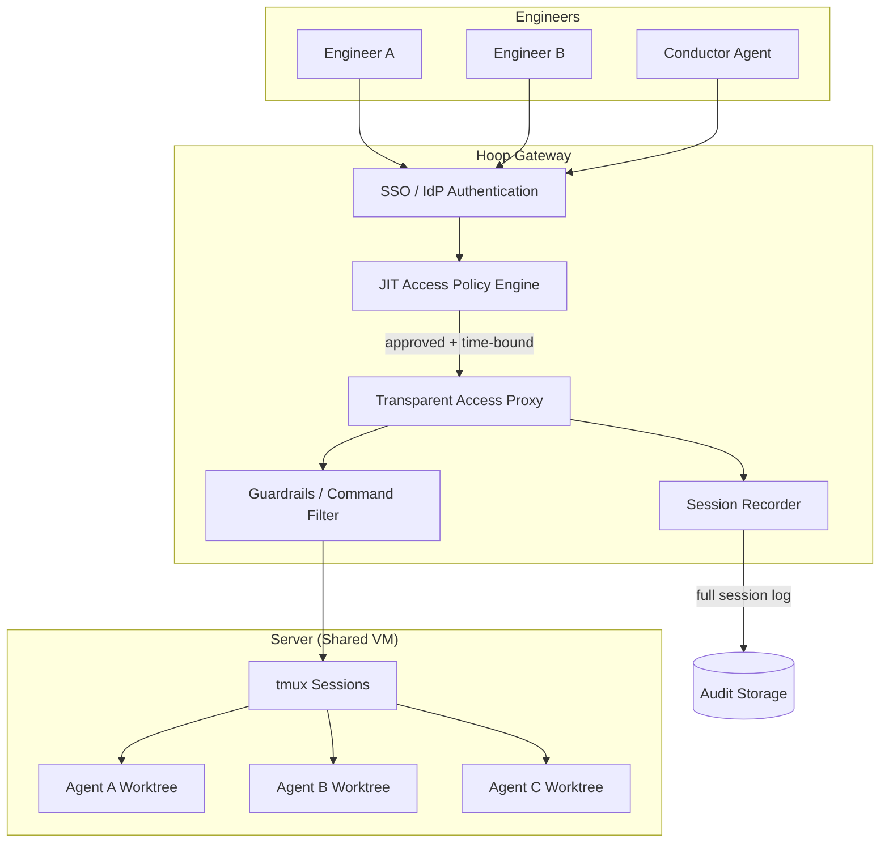
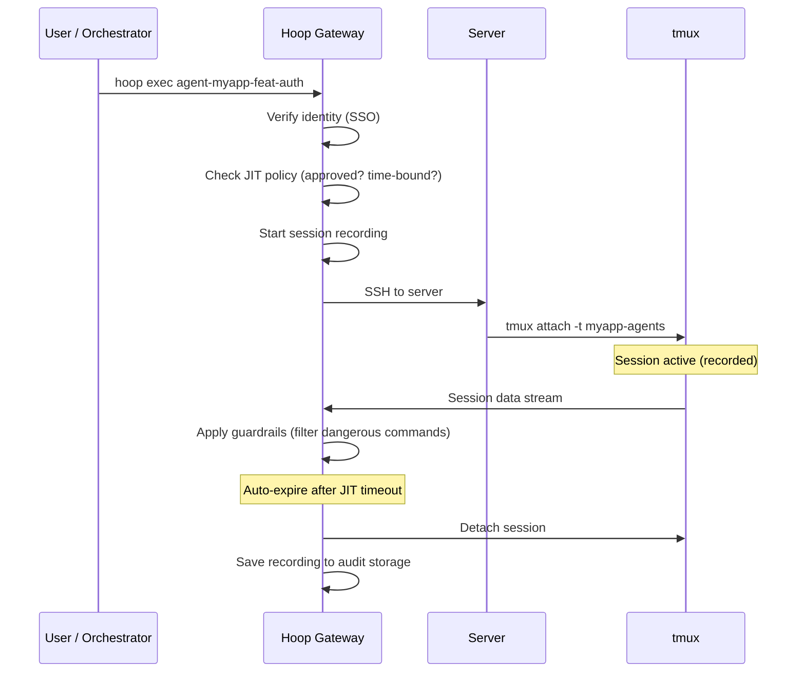

# Concept — Infrastructure-Level Access Control for Multi-Agent Deployments

> Why application-layer proxies fall short when multiple engineers orchestrate agent swarms on shared VMs, and how Hoop.dev fills the gap.

## The Governance Gap

tenai-infra enables multiple engineers to dispatch parallel AI agents across shared servers via tmux sessions. As deployments scale from a single developer to a team, critical governance issues emerge:

| Risk | Scenario |
|------|----------|
| **Unauthorized persistent access** | Engineer attaches to another's agent tmux pane and modifies work in progress |
| **Unaudited sessions** | No record of who attached to which session, when, or what commands were executed |
| **Credential exposure** | `.env` files with API keys accessible to any user on the shared VM |
| **Stale sessions** | Forgotten tmux sessions remain attached indefinitely with active agent credentials |
| **Compliance gaps** | No SOC 2 / ISO 27001 evidence trail for AI-driven code changes |

Application-layer controls (SSH keys, firewall rules) manage *who can access the machine* but not *who can access which tmux session* or *what they can do once attached*.

## Hoop.dev Architecture

[Hoop.dev](https://hoop.dev) is an open-source infrastructure access gateway that manages terminal access at the fundamental infrastructure level.



### Core Capabilities

| Capability | What It Does | Why It Matters for Agent Swarms |
|-----------|-------------|-------------------------------|
| **Just-In-Time Access** | Access granted on request with auto-expiry | Agent sessions time-bound; no stale access |
| **Cryptographic Authentication** | All session attachments verified via SSO/IdP | Every tmux attach traced to a real identity |
| **Session Recording** | Full-fidelity keystroke/output capture | Compliance audit trail for AI agent actions |
| **Guardrails** | Command filtering with context awareness | Prevent agents from executing dangerous ops |
| **Access Reviews** | Automated periodic review of permissions | Ensure least-privilege as team changes |
| **Connection Definitions** | Named, typed connections to infrastructure | `hoop connect agent-session-42` instead of raw SSH |

## Integration with tenai-infra

### Connection Model

Each agent dispatch creates a Hoop connection:

```yaml
# hoop.yaml — connection definitions
connections:
  - name: "agent-{{repo}}-{{branch}}"
    type: custom
    command:
      - tmux
      - attach-session
      - "-t"
      - "{{repo}}-agents"
    access_mode: exec
    overwrite: true
    agent_id: "{{device}}"
```

### Dispatch Flow with Hoop



### Configuration

```yaml
# config/defaults.yaml — access_control section
access_control:
  hoop:
    enabled: false                    # opt-in
    gateway_url: ""                   # e.g. https://hoop.example.com
    agent_id: ""                      # hoop agent installed on server
    jit_timeout_minutes: 120          # auto-expire agent sessions
    session_recording: true           # record all tmux attachments
    guardrails:
      block_commands:                 # commands agents cannot execute
        - "rm -rf /"
        - "sudo su"
        - "passwd"
      require_review_for:             # commands requiring human approval
        - "git push --force"
        - "DROP TABLE"
```

### Installation Pattern

Following the existing `install_gastown()` / `install_symphony()` pattern in `tools.sh`:

```bash
install_hoop() {
  echo "── Installing Hoop.dev Agent ──"
  local skip_name="hoop"
  _should_skip "$skip_name" && return 0
  
  if command -v hoop &>/dev/null; then
    echo "  ✓ Hoop already installed"
    return 0
  fi
  
  # Download binary from GitHub releases
  local os=$(uname -s | tr '[:upper:]' '[:lower:]')
  local arch=$(uname -m)
  [[ "$arch" == "x86_64" ]] && arch="amd64"
  [[ "$arch" == "aarch64" ]] && arch="arm64"
  
  curl -fsSL "https://releases.hoop.dev/release/latest/hoop_${os}_${arch}" \
    -o /usr/local/bin/hoop && chmod +x /usr/local/bin/hoop
  
  echo "  ✓ Hoop installed"
}
```

## Compliance Model

| Standard | Hoop Coverage | tenai-infra Integration |
|----------|--------------|----------------------|
| **SOC 2 Type II** | Session recording, access reviews | Audit trail for all agent-generated code changes |
| **ISO 27001** | Access control, logging | JIT policies enforce least-privilege |
| **PCI DSS** | Session monitoring, access management | Guardrails prevent data exfiltration commands |
| **GDPR** | Data access logging | Track who accessed which repo/data via agents |

## Session Recording for Agent Forensics

Beyond compliance, session recordings enable **agent forensics**:

- **Debugging failed tasks**: replay the agent's terminal session to see where it went wrong
- **Training data**: recorded sessions show what efficient vs. inefficient agent behavior looks like
- **Token audit**: verify that PROOF.md token counts match actual session activity
- **Security review**: detect if an agent attempted unauthorized operations

## Related Documents

- [CONCEPT_ai_dlc.md](CONCEPT_ai_dlc.md) — TWTL framework and measurement
- [CONCEPT_gastown_beads.md](CONCEPT_gastown_beads.md) — Persistent agent memory
- [CONCEPT_agent_system.md](CONCEPT_agent_system.md) — Agent system architecture
- [EXAMPLE_ai_dlc_access_control.md](EXAMPLE_ai_dlc_access_control.md) — Build guide for Hoop integration
