# Concept — Agent System Architecture

> How tenai-infra orchestrates parallel AI agents across mesh devices.

## System Overview

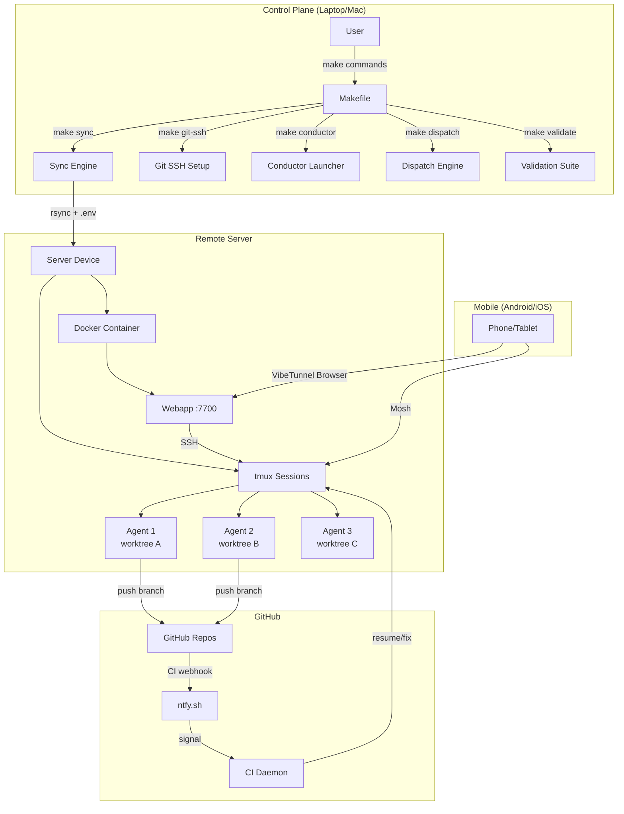

## Conductor → Dispatch → Verify Flow

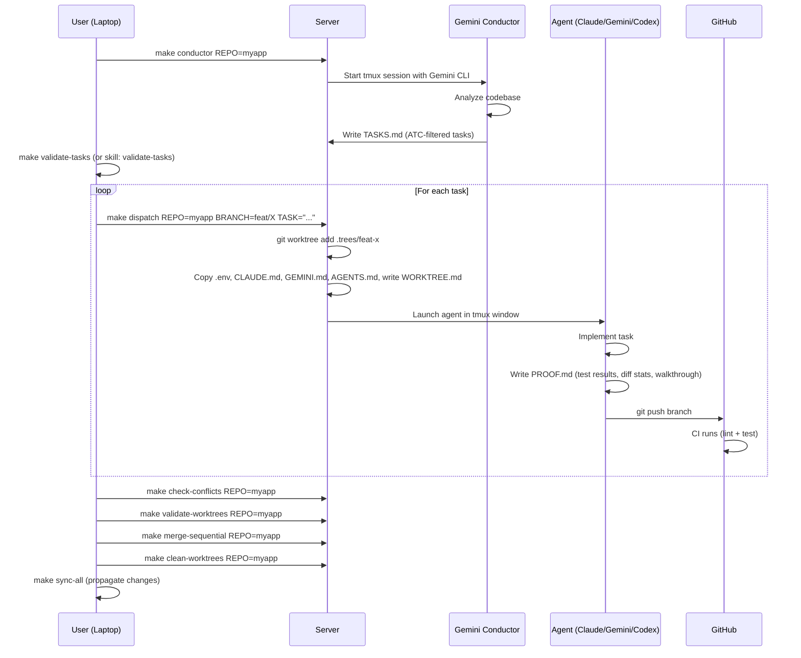

## Worktree Isolation Model

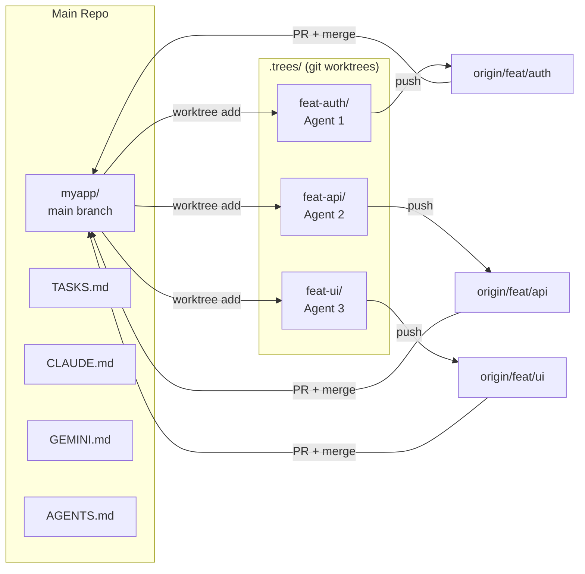

Each worktree is an isolated copy with its own:
- Working directory and index
- Branch (no interference between agents)
- Copied `.env` and agent instruction files (`WORKTREE.md`)
- `CLAUDE.md` / `GEMINI.md` / `AGENTS.md` for context

## Harness Engineering

All agent instruction files follow OpenAI's harness engineering principles:

| Principle | Implementation |
|-----------|---------------|
| **Context Engineering** | `CLAUDE.md`, `GEMINI.md`, `AGENTS.md`, `WORKTREE.md`, `docs/` |
| **Architectural Constraints** | `make lint && make test` after every change |
| **Entropy Management** | Dead code removal, doc updates, test coverage |

## CLI-Native Skills

ATC validation and proof-of-work are available as native skills for each CLI:

| CLI | Skills Location | Invocation |
|-----|----------------|------------|
| **Claude** | `.claude/commands/` | `/validate-tasks`, `/proof-of-work`, `/implement-task`, `/register-task` |
| **Gemini** | `.gemini/skills/` | Automatic by description match |
| **Codex** | `.codex/skills/` | `/validate-tasks`, `/proof-of-work`, `/implement-task`, `/register-task` |

## Task Database

All tasks from any source are stored in the SQLite database (`~/.tenai/tenai.db`):

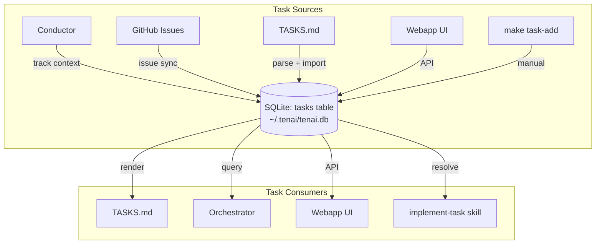

### Schema Highlights

| Field Group | Fields | Purpose |
|------------|--------|--------|
| **Identity** | `id`, `number`, `title`, `repo`, `branch` | Task identification |
| **Content** | `description`, `verification` | What to implement |
| **Context** | `context_type`, `context_ref` | Pointer to rich context |
| **Lineage** | `created_by`, `created_by_cli`, `created_by_model` | Who/what created it |
| **Conductor** | `conductor_track`, `conductor_spec`, `conductor_plan` | Links to track files |
| **GitHub** | `github_issue`, `github_repo`, `github_url` | Issue tracker link |
| **Execution** | `dispatch_device`, `dispatch_cli`, `proof_path` | Runtime state |

| Command | Purpose |
|---------|---------|
| `make task-add REPO=x TITLE="..."` | Add task manually |
| `make task-register REPO=x TITLE="..." CLI=x` | Register with auto-detect |
| `make task-list REPO=x` | List tasks from DB |
| `make task-query PATTERN="x" STATUS=y` | Rich query (filters) |
| `make task-import REPO=x` | Import TASKS.md to DB |
| `make tasks REPO=x` | Render TASKS.md from DB |

### Task Registration Flow

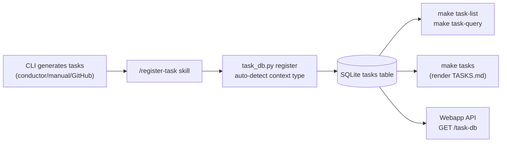

## Context Resolution Pipeline

When an agent is dispatched, the `implement-task` skill resolves context:

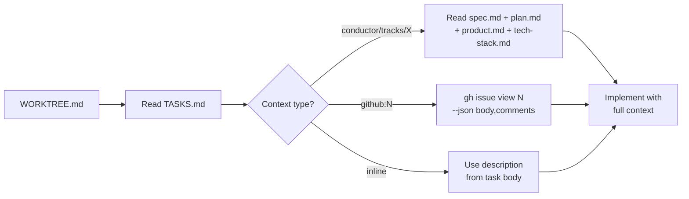

### Enhanced TASKS.md Format

```markdown
### Task 1: Implement auth login flow
Branch: feat/auth-login
Context: conductor/tracks/auth-login
Created-by: gemini-conductor (gemini-3.1-pro) @ 2026-03-15
Implement OAuth2 login flow.
Verification: pytest tests/test_auth.py passes
```

## Conductor Integration

Two conductor implementations support spec-driven development:

| Implementation | Install | CLI Support | Commands |
|---------------|---------|-------------|----------|
| **Gemini built-in** | `gemini extensions install .../conductor` | Gemini only | `/conductor:setup`, `/conductor:newTrack`, `/conductor:implement` |
| **get10acious/conductor** | `make cli-setup` | Claude + Codex + Gemini | `/conductor:setup`, `/conductor:new-track`, `/conductor:implement` |

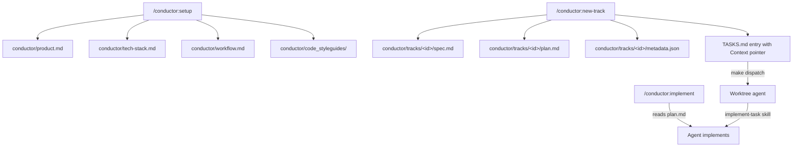

## Merge Safety Pipeline

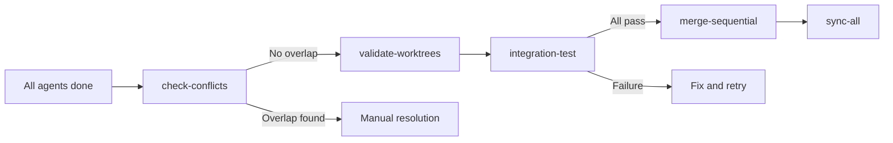

| Step | Command | Purpose |
|------|---------|--------|
| 1. Check overlap | `make check-conflicts REPO=x` | Detect file conflicts |
| 2. Per-worktree | `make validate-worktrees REPO=x` | Run tests in each worktree |
| 3. Integration | `make integration-test REPO=x` | Merge all → test branch → validate |
| 4. Sequential | `make merge-sequential REPO=x` | Merge one-by-one, validate after each |

## Device Roles

| Device Type | Role | Capabilities |
|------------|------|-------------|
| **Laptop/Mac** | Control plane | Runs `make` commands, syncs code, triggers remote work |
| **Server** | Compute plane | Runs agents, hosts webapp, Docker, tmux sessions |
| **Android/iOS** | Monitor plane | Views VibeTunnel browser UI, Mosh into sessions |

## GitHub Issues Integration

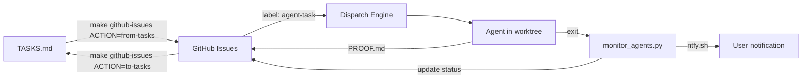

| Command | Purpose |
|---------|---------|
| `make github-issues REPO=x ORG=y` | List issues labeled `agent-task` |
| `make github-issues REPO=x ORG=y ACTION=to-tasks` | Convert issues → TASKS.md |
| `make github-issues REPO=x ORG=y ACTION=from-tasks` | Create issues from TASKS.md |
| `make monitor-agents [REPO=x]` | Watch agents, post proof, send ntfy |

## Agent Monitoring

The `monitor_agents.py` daemon polls tmux sessions for completed agents:
1. **Detect** agent pane exit (tmux pane dead)
2. **Read** PROOF.md from worktree
3. **Post** proof as GitHub Issue comment
4. **Notify** via ntfy.sh
5. **Report** when all agents are done → ready for merge safety

## Optional Tools

| Tool | Install | Purpose |
|------|---------|---------|
| **Symphony** | `make install-symphony` | Orchestrator that polls Linear/GitHub, launches Codex agents |
| **Gastown** | `make install-gastown` | Session history, persistent work state across CLI sessions |

## Session History

When agents are dispatched, a `.session_start` file is recorded in each worktree with:
- Timestamp, CLI used, task description, tmux session/window

After agents complete, use `make agent-history` for a unified view:

```bash
make agent-history REPO=myapp                  # table view
make agent-history REPO=myapp FORMAT=summary   # one-line summary
make agent-history REPO=myapp FORMAT=json      # machine-readable
```

Example output:
```
══ Agent History: myapp ══

   Branch                         CLI      Status     Duration   Proof  Commits
   ------------------------------ -------- ---------- ---------- ------ --------
  ● feat-auth                     claude   completed  1h 23m     ✓      4
      Task: Implement OAuth2 login flow
      Proof: Test Results
  ◐ feat-api                      gemini   running    0h 45m     -      2
      Task: Create REST API endpoints
  ○ feat-ui                       codex    no_session -          -      0

  Sessions: 3 (1 running, 1 completed)
  Proofs:   1/3
  Commits:  6
  → 1 agent(s) still running.
```

## Full Orchestrator Loop

The `make orchestrate` command runs the complete automated pipeline:

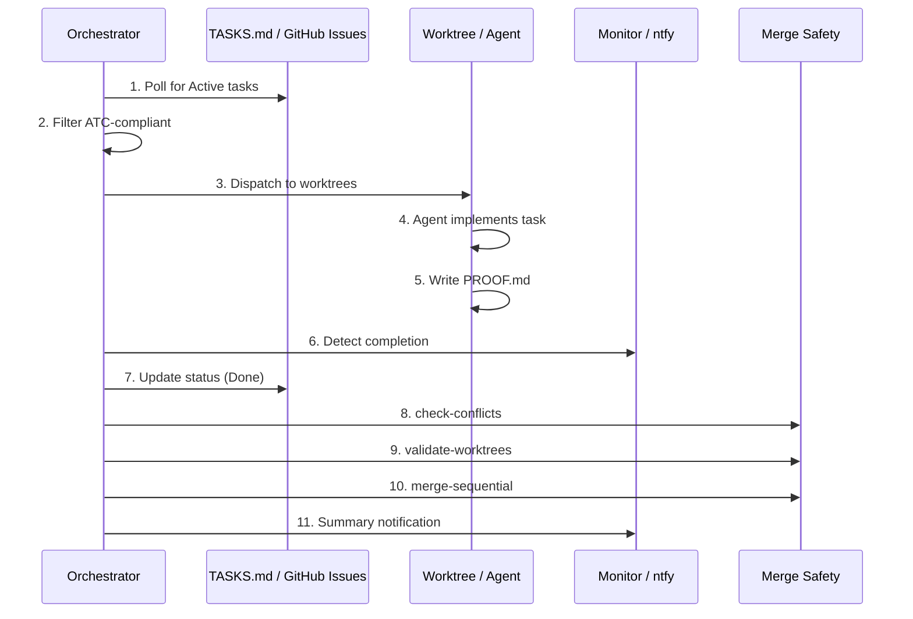

| Command | Mode |
|---------|------|
| `make orchestrate REPO=x CLI=claude` | Full automated loop |
| `make orchestrate-webhook NTFY_TOPIC=t` | Listen for remote triggers |

## Webapp Job System

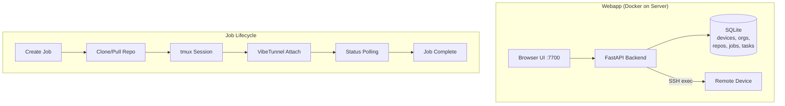

Job actions:

| Action | Creates Worktree | Starts Agent | Opens Shell |
|--------|:----------------:|:------------:|:-----------:|
| Interactive Shell | ❌ | ❌ | ✅ |
| Start Conductor | ❌ | ✅ Gemini | ❌ |
| Dispatch Agent | ✅ | ✅ Claude/Gemini/Codex | ❌ |
| Clone Repo | ❌ | ❌ | ❌ |
| Pull Repo | ❌ | ❌ | ❌ |

## ATC Task Filter

Tasks generated by the conductor must pass the ATC filter for safe parallel execution:

| Criterion | Meaning | Why it matters |
|-----------|---------|---------------|
| **Self-Contained** | Works in its own worktree | No cross-task file dependencies |
| **Verifiable** | Has clear pass/fail criteria | Agent knows when it's done |
| **Bounded** | Completable in < 2 hours | Prevents runaway agents |
| **Parallelizable** | No cross-task dependencies | Multiple agents work simultaneously |
| **Resume-safe** | Can be restarted without side effects | Idempotent agent behavior |

## CI Integration

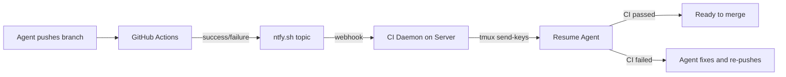

## Recommended Workflow

### Quick Start (single task)
```bash
make new-server HOST=myserver          # bootstrap device
make sync HOST=myserver                # sync code
make git-ssh HOST=myserver             # set up GitHub access
# Create a job from webapp or:
make dispatch REPO=myapp BRANCH=feat/x TASK="implement login"
```

### Full Multi-Agent Flow
```bash
# 1. Plan
make conductor REPO=myapp              # Gemini generates TASKS.md
make validate-tasks REPO=myapp         # Verify ATC compliance

# 2. Fan out (manual or auto)
make dispatch REPO=myapp BRANCH=feat/auth TASK="Task 1" CLI=claude
make dispatch REPO=myapp BRANCH=feat/api  TASK="Task 2" CLI=gemini
make dispatch REPO=myapp BRANCH=feat/ui   TASK="Task 3" CLI=codex
# OR auto-dispatch all Active tasks:
make dispatch-tasks REPO=myapp

# 3. Monitor
tmux attach -t myapp-agents             # tmux window per agent
# or open webapp at http://<server>:7700
# or use Tasks tab in webapp for batch dispatch

# 4. Verify & merge
make check-conflicts REPO=myapp         # detect file overlap
make validate-worktrees REPO=myapp      # test each worktree
make merge-sequential REPO=myapp        # merge one-by-one safely

# 5. Cleanup
make clean-worktrees REPO=myapp
make sync-all                           # propagate to all devices
```

### From Webapp
1. Select org + repo from sidebar
2. Choose action (Shell / Conductor / Dispatch)
3. Pick target device
4. Monitor via job list + VibeTunnel browser terminal

## Key Configuration

```yaml
# config/defaults.yaml
conductor:
  gemini_model: "gemini-3.1-pro"
  claude_model: "sonnet"
  codex_model: ""
  task_output_file: "TASKS.md"
  split_pane: false

ci:
  local_validate: ["make lint", "make test"]
  budget_cap_usd: 5.0

symphony:
  enabled: false
  ntfy_topic: "<unique-topic-for-symphony>"

gastown:
  enabled: true

repos:
  base_dir: "~/tenai-projects"

organizations:
  <org-name>:
    ssh_key: "~/.ssh/<existing-or-new-ssh-key-name>"
```

## Complete Command Reference

| Phase | Command | Purpose |
|-------|---------|--------|
| **Setup** | `make new-server HOST=x` | Bootstrap device |
| **Sync** | `make sync HOST=x` | Sync code + rebuild webapp |
| **Plan** | `make conductor REPO=x` | Gemini generates TASKS.md |
| **Validate** | `make validate-tasks REPO=x` | ATC compliance check |
| **Tasks** | `make task-add REPO=x TITLE="..."` | Add task to DB |
| **Tasks** | `make task-list REPO=x` | List tasks from DB |
| **Tasks** | `make tasks REPO=x` | Render TASKS.md from DB |
| **GitHub** | `make github-issues REPO=x ORG=y` | Sync with GitHub Issues |
| **Dispatch** | `make dispatch REPO=x BRANCH=b` | Single agent dispatch |
| **Dispatch** | `make dispatch-tasks REPO=x` | Fan out all Active tasks |
| **Orchestrate** | `make orchestrate REPO=x` | Full auto loop |
| **Monitor** | `make monitor-agents REPO=x` | Watch + notify |
| **History** | `make agent-history REPO=x` | Session timeline |
| **Merge** | `make check-conflicts REPO=x` | File overlap check |
| **Merge** | `make merge-sequential REPO=x` | Safe merge |
| **Webhook** | `make orchestrate-webhook` | Remote trigger |
