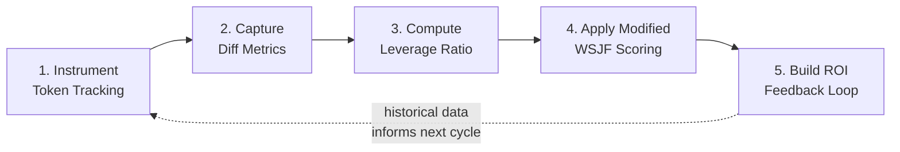
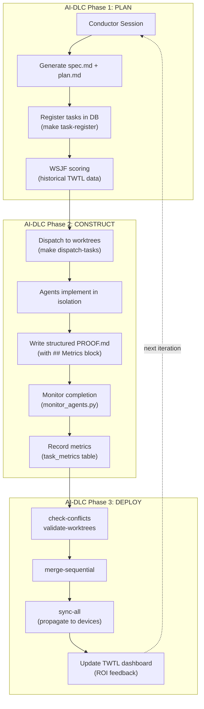
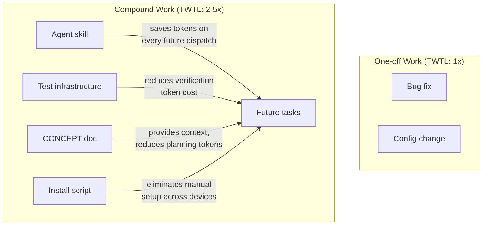

# Concept — AI Development Lifecycle & Token-Weighted Technical Leverage

> How to measure, prioritize, and compound AI-assisted development using native token economics.

## The AI Productivity Paradox

Traditional software metrics (LOC/hour, story points/sprint, velocity) fail for AI-assisted development because:

1. **Token cost ≠ human time** — an agent consuming 50K tokens in 3 minutes can produce the same output as 4 hours of manual coding
2. **Reuse is invisible** — a skill or infra component built once compounds across every future task, but this leverage is never captured
3. **Quality is non-linear** — AI can produce working code that passes tests but introduces subtle architectural debt, or produce elegant solutions that prevent entire categories of future bugs

The native unit of AI work is the **token**, not the hour. Measuring ROI requires a token-native framework.

## Token-Weighted Technical Leverage (TWTL)

**Formal Definition:**

```
TWTL = (Lines Changed × Reuse Multiplier) / Tokens Consumed
```

| Component | Meaning | Source |
|-----------|---------|--------|
| **Lines Changed** | `lines_added + lines_removed` | `git diff --stat` at task completion |
| **Reuse Multiplier** | How widely reusable is this output | Human-assigned score (see scale below) |
| **Tokens Consumed** | `tokens_input + tokens_output` | Langfuse trace or CLI session stats |

### Reuse Multiplier Scale

| Score | Category | Example |
|-------|----------|---------|
| **1.0** | One-off | Bug fix, config tweak |
| **2.0** | Repo-reusable | Shared utility, test helper |
| **3.0** | Cross-repo reusable | Library, shared component |
| **5.0** | Platform-level | Skill, infra script, framework extension |

### Interpreting TWTL

| TWTL Range | Meaning |
|------------|---------|
| < 0.01 | Low leverage — high token cost relative to output |
| 0.01–0.05 | Normal — typical task execution |
| 0.05–0.20 | High leverage — efficient, focused work |
| > 0.20 | Exceptional — likely a reusable platform contribution |

## The 5 Implementation Steps

These steps form the iterative pipeline for building TWTL measurement into tenai-infra:



### Step 1: Instrument Token Tracking
- Deploy self-hosted Langfuse (Docker, same pattern as webapp)
- Add `LANGFUSE_PUBLIC_KEY`, `LANGFUSE_SECRET_KEY`, `LANGFUSE_BASE_URL` to `.env`
- Initialize Langfuse Python SDK in the metrics module
- Each agent session creates a Langfuse trace with `task_id` as the trace ID

### Step 2: Capture Diff Metrics on Completion
- On dispatch: record `start_time` in `task_metrics` table
- On completion: run `git diff --stat` in the worktree, parse PROOF.md's `## Metrics` block
- Store `lines_added`, `lines_removed`, `files_changed`, `wall_time_secs`

### Step 3: Compute Leverage Ratio per Task
- Pull token counts from Langfuse (or PROOF.md fallback)
- Apply TWTL formula: `(lines_changed × reuse_score) / tokens_total`
- Store `leverage_ratio` and `twtl_score` in `task_metrics`

### Step 4: Apply Modified WSJF for Prioritization
- Score pending tasks before dispatch using historical averages
- Modified WSJF = `(Business Value + Time Criticality + Risk Reduction + Reuse Multiplier) / Estimated Task Size`
- `Estimated Task Size` refined by historical TWTL from similar tasks

### Step 5: Build ROI Feedback Loop
- TWTL KPI Dashboard in webapp (see Dashboard Vision below)
- Weekly/monthly aggregate reports
- Historical data informs next cycle's task sizing and prioritization

## AI-DLC Phases → tenai-infra Mapping



| AI-DLC Phase | tenai-infra Stage | Key Commands |
|-------------|-------------------|--------------|
| **Plan** | Conductor + task DB | `make conductor`, `make task-register`, `make validate-tasks` |
| **Construct** | Worktree dispatch + agents | `make dispatch-tasks`, `make monitor-agents` |
| **Deploy** | Merge safety + sync | `make merge-sequential`, `make sync-all` |

## Compound Engineering

Certain outputs have multiplicative TWTL value because they reduce token cost of all future tasks:



**Implication for prioritization**: Platform-level compound work (skills, infra, docs) should receive higher WSJF scores via the Reuse Multiplier, even if its immediate business value seems lower.

## TWTL KPI Dashboard Vision

The webapp dashboard should surface these metrics:

### Per-Task View

| Metric | Source | Display |
|--------|--------|---------|
| Tokens consumed | Langfuse / PROOF.md | Input/Output breakdown bar |
| Cost (USD) | Rate card × tokens | Dollar amount |
| Wall time | `start_time` → `end_time` | Duration |
| Lines changed | `git diff --stat` | +/- sparkline |
| TWTL score | Computed | Gauge/number |
| Reuse multiplier | Human-assigned | Badge (1x/2x/3x/5x) |

### Aggregate Views

| View | Visualization |
|------|--------------|
| **Cost per repo** | Stacked bar (by CLI/model) |
| **TWTL trend** | Line chart over time |
| **Reuse distribution** | Donut chart (1x/2x/3x/5x breakdown) |
| **Budget burn rate** | Running total vs cap |
| **Top leverage tasks** | Ranked table |
| **Model efficiency** | TWTL by model comparison |

### Target Queries

```sql
-- Average TWTL by repo
SELECT t.repo, AVG(m.twtl_score) as avg_twtl, SUM(m.cost_usd) as total_cost
FROM task_metrics m JOIN tasks t ON m.task_id = t.id
GROUP BY t.repo;

-- Best leverage tasks (top 10)
SELECT t.title, m.twtl_score, m.cost_usd, m.reuse_score
FROM task_metrics m JOIN tasks t ON m.task_id = t.id
ORDER BY m.twtl_score DESC LIMIT 10;

-- Monthly cost trend
SELECT strftime('%Y-%m', m.created_at) as month, SUM(m.cost_usd) as cost
FROM task_metrics m GROUP BY month ORDER BY month;
```

## Structured PROOF.md Format

Every agent should produce PROOF.md with a structured `## Metrics` section:

```markdown
# PROOF.md

## Test Results
- `make lint` → passed
- `make test` → 12 passed, 0 failed

## Files Changed
 src/module.py    | 120 +++++++++
 tests/test_mod.py|  45 ++++
 2 files changed, 165 insertions(+)

## Metrics
```yaml
tokens_input: 12500
tokens_output: 8300
model: claude-sonnet-4-20250514
wall_time_minutes: 45
lines_added: 165
lines_removed: 0
files_changed: 2
reuse_score: 2.0
confidence: 4
complexity: moderate
ci_status: passed
```​

## Walkthrough
...
```

The `## Metrics` YAML block is machine-parseable by `metrics.py` and feeds the `task_metrics` table.

## Related Documents

- [CONCEPT_gastown_beads.md](CONCEPT_gastown_beads.md) — Persistent agent memory via the Beads Ledger
- [CONCEPT_access_control.md](CONCEPT_access_control.md) — Hoop.dev for multi-agent governance
- [EXAMPLE_ai_dlc_measurement.md](EXAMPLE_ai_dlc_measurement.md) — Build the metrics infrastructure
- [EXAMPLE_ai_dlc_prioritization.md](EXAMPLE_ai_dlc_prioritization.md) — WSJF scoring and dashboard
- [CONCEPT_agent_system.md](CONCEPT_agent_system.md) — Agent system architecture
- [DATA_FLOW_tasks.md](DATA_FLOW_tasks.md) — Task lifecycle pipeline
