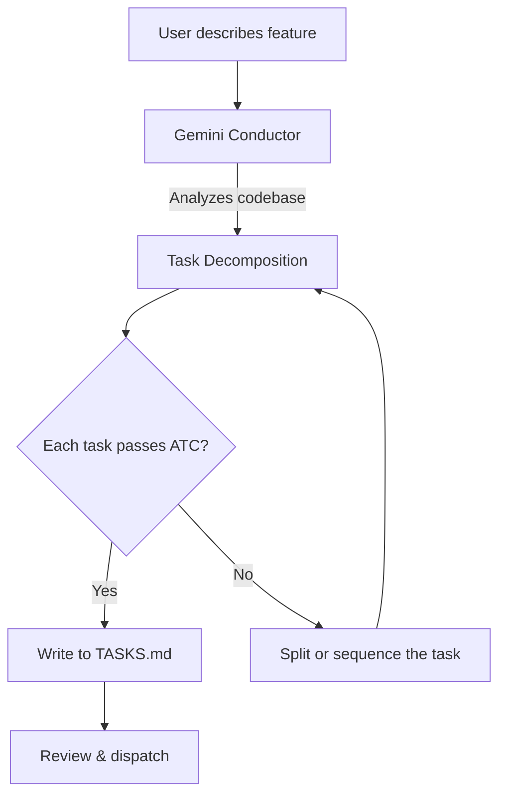

# Concept — ATC Task Filter for Parallel Agent Work

> The ATC filter is a set of criteria for tasks generated by the Gemini Conductor. Tasks that pass the filter can be safely dispatched to parallel AI agents working in isolated git worktrees.

## What is ATC?

ATC stands for the five qualities every task must have before it can be dispatched to an autonomous agent:

| Criterion | Question to Ask | Why It Matters |
|-----------|----------------|---------------|
| **Self-Contained** | Can this task be completed in a single git worktree without touching files owned by another task? | Prevents merge conflicts between parallel agents |
| **Verifiable** | Is there a clear, automatable pass/fail test? | Agent must know when it's done; CI must confirm correctness |
| **Bounded** | Can an agent finish this in < 2 hours of wall-clock time? | Prevents runaway token spend and stuck agents |
| **Parallelizable** | Does this task depend on the output of any other task? | If yes, it must wait — sequence it after the dependency |
| **Resume-safe** | If the agent crashes and restarts, will the task still complete correctly? | Agents in tmux can be interrupted by network drops, OOM, etc. |

## How ATC is Enforced



### Step 1: Conductor generates tasks

The conductor prompt instructs Gemini to apply ATC on every task:

```
You are the Conductor for project <repo>. Analyze the codebase, then populate
TASKS.md with a prioritized backlog of tasks. Each task MUST pass the ATC filter:
- Self-Contained: works in its own worktree, no shared mutable files
- Verifiable: has `make test` or explicit success criteria
- Bounded: completable in < 2 hours
- Parallelizable: no cross-task data dependencies
- Resume-safe: idempotent, can be restarted
```

### Step 2: Task parser validates structure

`scripts/conductor/parse_tasks.py` reads TASKS.md and extracts structured tasks. Each task must have:

| Field | Required | Description |
|-------|:--------:|-------------|
| `title` | ✅ | Task heading (e.g., "Add agent CLI selector to webapp") |
| `branch` | ✅ | Git branch name (e.g., `feat/agent-selector`) |
| `description` | ✅ | What to implement |
| `verification` | ✅ | How to verify success (e.g., "`make test` passes") |
| `section` | — | Current section: `Active`, `In Progress`, or `Done` |

### Step 3: Dispatch to worktrees

Each valid task becomes an isolated worktree with its own agent:

```
myapp/
├── .git/                    # main repo
├── .trees/
│   ├── feat-auth/           # Agent 1 (Claude)
│   ├── feat-api/            # Agent 2 (Gemini)
│   └── feat-ui/             # Agent 3 (Codex)
└── TASKS.md                 # shared task board
```

## TASKS.md Format

The conductor generates TASKS.md in this format. The parser expects `### Task N:` headings with `Branch:` and `Verification:` fields:

```markdown
# TASKS.md — Agent Task Backlog
# Each task must pass the ATC filter:
# Self-Contained | Verifiable | Bounded | Parallelizable | Resume-safe

## Active

### Task 1: Add AGENT_CLI config to defaults.yaml
Branch: feat/agent-config
Add AGENT_CLI=claude|gemini|codex to config. Default: claude.
Verification: `make test` passes, .env.example updated.

### Task 2: Update worktree.sh for multiple CLIs
Branch: feat/multi-agent-dispatch
Modify do_dispatch() to read AGENT_CLI env var.
Verification: `AGENT_CLI=gemini make dispatch REPO=x BRANCH=test` works.

## In Progress
<!-- Tasks move here when dispatched to an agent -->

## Done
<!-- Completed tasks -->
```

## Common ATC Violations and Fixes

| Violation | Example | Fix |
|-----------|---------|-----|
| **Not self-contained** | "Refactor auth module" + "Add auth tests" both touch `auth/` | Merge into one task: "Refactor auth module with tests" |
| **Not verifiable** | "Improve code quality" | Specify: "Fix all ruff lint errors in `webapp/`" |
| **Not bounded** | "Rewrite the entire API layer" | Split by endpoint: "Add `/users` endpoint", "Add `/repos` endpoint" |
| **Not parallelizable** | "Add database schema" + "Write queries using new schema" | Sequence: schema first, queries second |
| **Not resume-safe** | "Run migration, then seed data" | Make migration idempotent with `IF NOT EXISTS` guards |

## CLI Integration

```bash
# Parse tasks from a local repo
python3 scripts/conductor/parse_tasks.py ~/projects/myapp

# Parse tasks from a remote device
make tasks HOST=myserver REPO=myapp

# Dispatch all Active tasks
make dispatch-tasks REPO=myapp HOST=myserver

# Dispatch specific task by number
make dispatch REPO=myapp BRANCH=feat/agent-config HOST=myserver \
  TASK="Task 1 from TASKS.md: Add AGENT_CLI config"
```

## Configuration

```yaml
# config/defaults.yaml
conductor:
  gemini_model: "gemini-3.1-pro"      # model for conductor sessions
  task_output_file: "TASKS.md"         # where tasks are written
  workflow:
    - spec       # analyze codebase
    - plan       # decompose into tasks
    - implement  # (optional) conductor implements simple tasks itself
```
