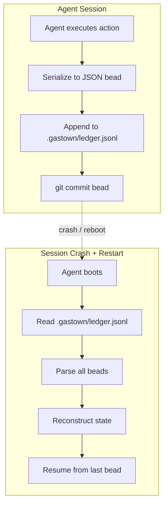
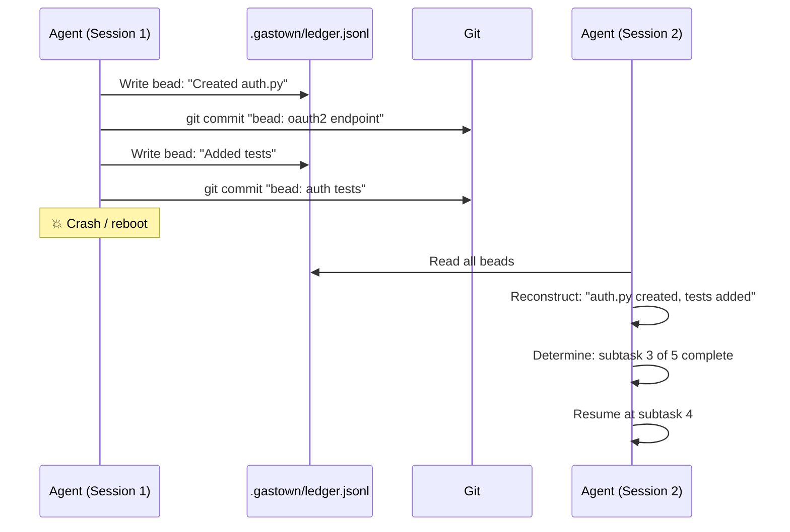
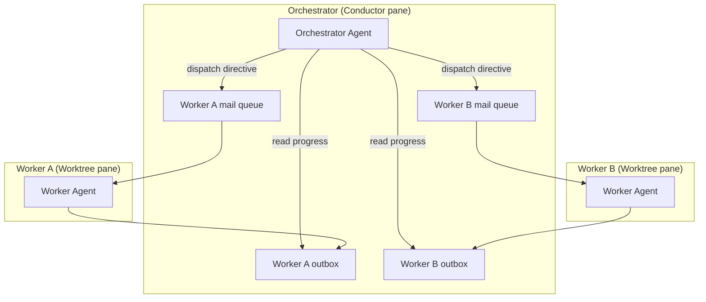
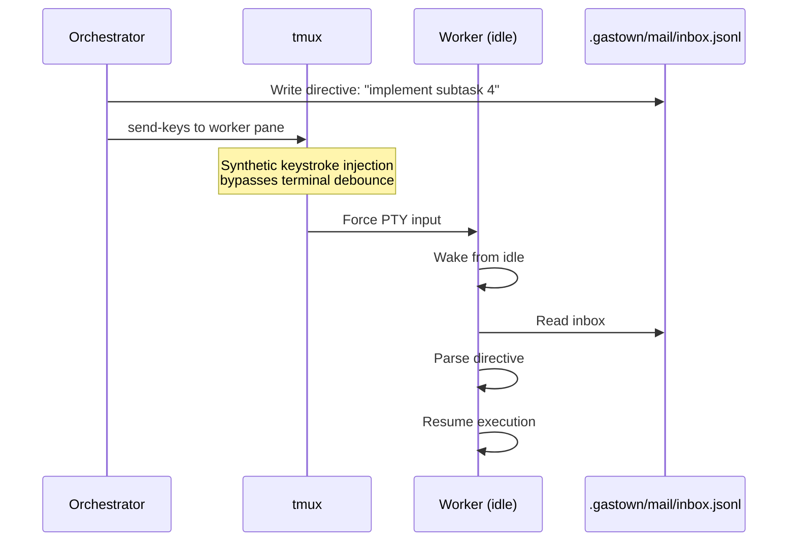
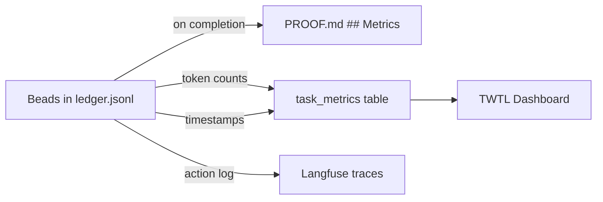

# Concept — Gastown Beads Ledger Architecture

> Persistent agent memory via source-control-backed ledger — enabling nondeterministic idempotence and swarm coordination.

## The Problem: Ephemeral Memory

Command-line AI agents have a fundamental flaw: **ephemeral memory**. When a background pane crashes, a server reboots, or an agent process is terminated, its internal conversational context is entirely obliterated. The agent cannot resume — it must start fresh, re-reading files, re-analyzing context, and re-consuming tokens for work already done.

In tenai-infra's multi-agent model, this is compounded:
- Multiple agents run in parallel tmux panes across devices
- Servers reboot, SSH sessions drop, Docker containers restart
- Agent CLI processes have no built-in persistence

**Cost of ephemeral memory**: every crash wastes 100% of the tokens consumed in the lost session, plus the tokens to re-establish context on restart.

## The Beads Ledger

The Gastown framework addresses this with a **persistent ledger system backed by source control**.



Every discrete action, natural language prompt, and tool execution result generated by an agent is serialized into a structured JSON payload (a **bead**) and committed to the repository alongside the actual source code.

### Bead Format

```json
{
  "id": "bead-2026-03-22-001",
  "timestamp": "2026-03-22T14:30:00Z",
  "type": "tool_execution",
  "agent_id": "claude-wt-feat-auth",
  "session_id": "sess-abc123",
  "task_id": 42,
  "action": {
    "tool": "replace_file_content",
    "file": "src/auth.py",
    "lines_changed": 45
  },
  "context": {
    "subtask": "Implement OAuth2 login endpoint",
    "phase": "construct",
    "progress_pct": 60
  },
  "tokens": {
    "input": 1200,
    "output": 850
  },
  "checkpoint": "oauth2_endpoint_created"
}
```

### Directory Layout

```
<worktree>/
├── .gastown/
│   ├── ledger.jsonl         ← Append-only bead log
│   ├── state.json           ← Current reconstructed state
│   ├── mail/                ← Inter-agent message queue
│   │   ├── inbox.jsonl      ← Messages from orchestrator
│   │   └── outbox.jsonl     ← Messages to orchestrator
│   └── config.json          ← Session config (agent ID, task, convoy)
├── WORKTREE.md
├── PROOF.md
└── .session_start
```

## Nondeterministic Idempotence

Because the agent's memory is permanently etched into the repository history, active sessions can be destroyed and recreated arbitrarily.



**Key property**: the agent does not need to replay actions — it reads the ledger to understand *what was done* and *what remains*, then continues from the latest checkpoint. This is "nondeterministic" because the resumed session may take a different execution path than the crashed session would have, but the end result converges to the same goal.

## Hierarchical Swarm: Orchestrators and Workers

Gastown categorizes agents into two roles:



| Role | Responsibility | tenai-infra Equivalent |
|------|---------------|----------------------|
| **Orchestrator** | Plans tasks, dispatches to workers, monitors progress, resolves conflicts | Conductor session (Gemini) |
| **Worker** | Implements single task in isolated worktree, writes PROOF.md | Dispatched agent (Claude/Gemini/Codex) |

## The Gupp Nudge

The **Gupp Nudge** is a mechanism for asynchronous inter-agent communication — triggering an idle background worker without human intervention.



**How it works:**

1. Orchestrator writes a directive to the worker's `mail/inbox.jsonl`
2. Orchestrator sends synthetic keystrokes to the worker's tmux pane via `tmux send-keys`
3. The keystrokes bypass terminal debounce issues and force the dormant worker to:
   - Read its mail queue
   - Parse the new directive
   - Resume active execution

**In tenai-infra terms**: the orchestrator is the conductor session, workers are dispatched agents, and the Gupp Nudge extends the existing `tmux send-keys` pattern already used in `worktree.sh` for agent dispatch.

## Integration with tenai-infra

### Existing Hooks (currently stubs)

| Component | Current State | Gastown Integration |
|-----------|--------------|-------------------|
| `.session_start` | Records timestamp, CLI, task | → Feed into bead: session metadata |
| `WORKTREE.md` | Task instructions | → Initial bead: task spec |
| `PROOF.md` | Final evidence | → Terminal bead: completion evidence |
| `gt convoy create` (worktree.sh L258) | Stub: `if command -v gt` | → Full convoy registration with session tracking |
| `gt hook` (worktree.sh L260) | Stub: registers hook | → Checkpoint bead on every commit |
| `get_gastown_hooks()` (session_history.py L133) | Returns empty list | → Parse convoy/hook data for metrics |

### Data Flow: Beads → Metrics



Each bead contains token counts for its action. On task completion, metrics.py can:
1. Sum all bead token counts → total `tokens_input` / `tokens_output`
2. Extract timestamps → `wall_time_secs`
3. Count checkpoint beads → subtask progress
4. Feed aggregate data into the `task_metrics` table

## Conflict Resolution

When parallel workers create beads that overlap (editing similar files), the version control system captures the conflict. The AI model performing the merge (`make merge-sequential`) can:

1. Read both workers' ledger histories
2. Understand the intent behind each change
3. Perform intelligent collision resolution
4. Commit a merge bead documenting the resolution

```
Worker A: bead-003 → edited src/auth.py (login endpoint)
Worker B: bead-005 → edited src/auth.py (logout endpoint)
Merge:    bead-merge-001 → resolved: both endpoints coexist, shared imports consolidated
```

## Related Documents

- [CONCEPT_ai_dlc.md](CONCEPT_ai_dlc.md) — TWTL framework and measurement
- [CONCEPT_agent_system.md](CONCEPT_agent_system.md) — Agent system architecture
- [EXAMPLE_ai_dlc_gastown.md](EXAMPLE_ai_dlc_gastown.md) — Build guide for implementing the Beads Ledger
