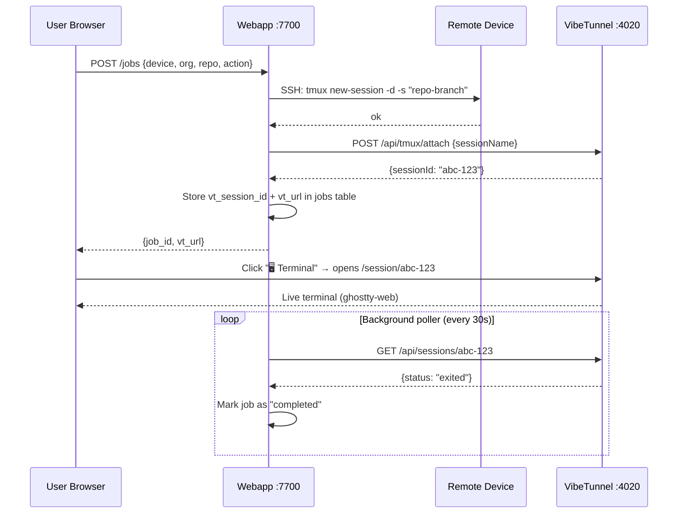

# Concept — Webapp ↔ VibeTunnel Integration

## Problem

The webapp creates jobs (tmux sessions on remote devices via SSH), but accessing those sessions requires manually opening VibeTunnel on port 4020. The user experience is fragmented across two UIs.

## Solution: API-Based Bridge

After the webapp creates a tmux session, it calls VibeTunnel's REST API to bridge the session to VT's browser terminal, giving the user a single-click "🖥 Terminal" button.

```
┌─────────────────────────────────────────────────────────────────────┐
│  User's Browser                                                     │
│                                                                     │
│  ┌─── Webapp (:7700) ───┐     ┌── VibeTunnel (:4020) ──┐          │
│  │                       │     │                         │          │
│  │  Create Job form      │     │  ghostty-web terminal   │          │
│  │  Job list + Terminal  │ ──→ │  /session/:id           │          │
│  │  buttons              │click│  (full terminal UI)     │          │
│  └───────────┬───────────┘     └────────────┬────────────┘          │
└──────────────┼──────────────────────────────┼───────────────────────┘
               │ REST API                      │ WebSocket (binary v3)
┌──────────────┼──────────────────────────────┼───────────────────────┐
│  Remote Device (e.g. server1)                │                       │
│              │                              │                       │
│  ┌───────────▼───────────┐     ┌────────────▼────────────┐         │
│  │   tmux sessions       │ ←── │   VibeTunnel server     │         │
│  │   (created via SSH)   │ PTY │   POST /api/tmux/attach │         │
│  └───────────────────────┘     └─────────────────────────┘         │
└─────────────────────────────────────────────────────────────────────┘
```

## Data Flow



## Key Design Decisions

| Decision | Rationale |
|----------|-----------|
| **No vt wrapping in tmux** | `vt` is a TTY forwarder — crashes in detached tmux (no TTY). VT discovers tmux sessions via its daemon |
| **API bridge, not iframe** | Full ghostty-web terminal quality, no cross-origin issues, no keyboard capture problems |
| **Graceful degradation** | If VT isn't running, VT attach silently fails and falls back to mosh connect command |
| **Background status sync** | Poller every 30s checks VT session status, auto-marks jobs as `completed` when VT reports `exited` |

## VibeTunnel API Endpoints Used

| Endpoint | Method | Purpose |
|----------|--------|---------|
| `/api/tmux/attach` | POST | Bridge PTY to existing tmux session → returns `sessionId` |
| `/api/sessions/:id` | GET | Check session status (`starting` / `running` / `exited`) |
| `/api/sessions` | GET | List all VT sessions |

## Database Schema (jobs table)

```sql
-- New columns for VT tracking
vt_session_id TEXT    -- UUID from VT's /api/tmux/attach
vt_url        TEXT    -- Deep-link: http://<ip>:4020/session/<id>
```

## Configuration

| Variable | Default | Purpose |
|----------|---------|---------|
| `VT_PORT` | `4020` | VibeTunnel server port on remote devices |

VT base URL is constructed from device Tailscale IP + `VT_PORT`.
