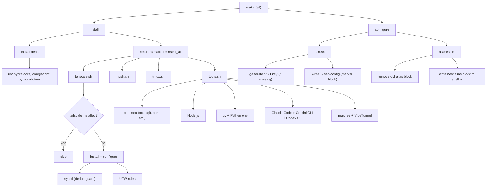

# Data Flow — Setup Pipeline

## `make` (Full Setup)

## Idempotency Guards

| Script | Guard Type | Mechanism |
|--------|-----------|-----------|
| Install scripts | **Skip guard** | `command -v <tool>` — skips if already installed |
| SSH config | **Replace guard** | Marker-based `START`/`END` block — deletes old, writes new |
| Aliases | **Replace guard** | Same marker-based approach |
| Sysctl | **Dedup guard** | `grep -qxF` — only appends if line not already present |
| tmux config | **Overwrite** | Full replacement with backup of previous |
| pip/uv deps | **Idempotent** | `uv pip install` is naturally idempotent (no-ops if satisfied) |
