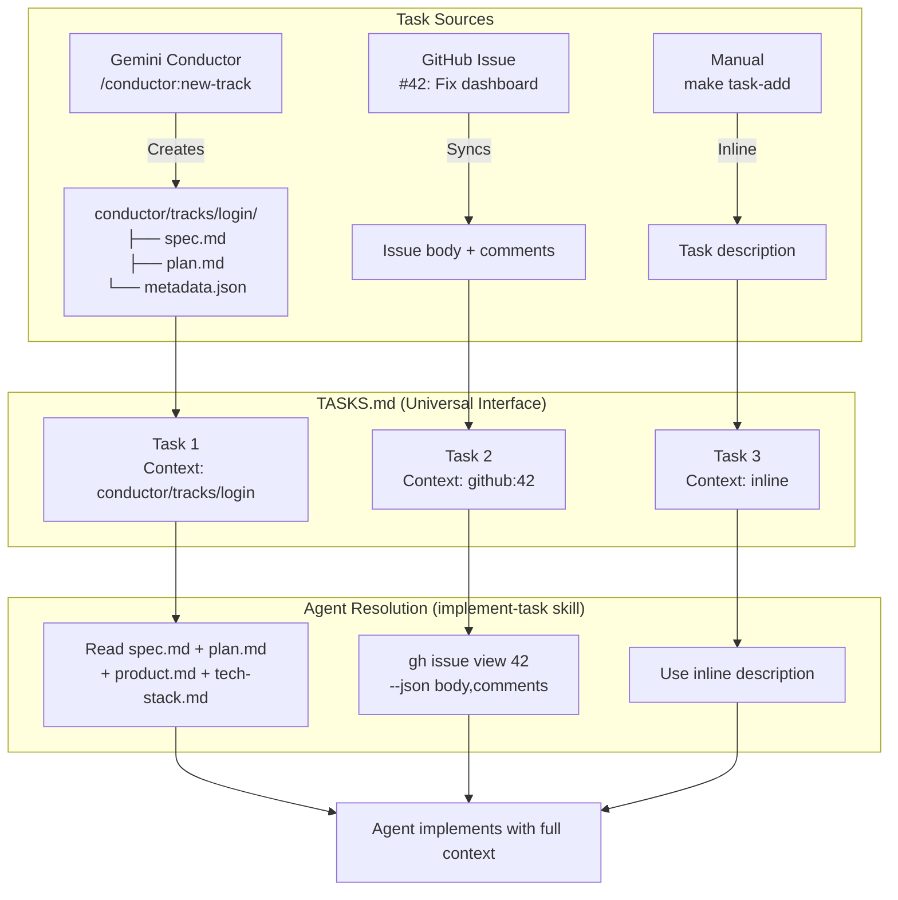
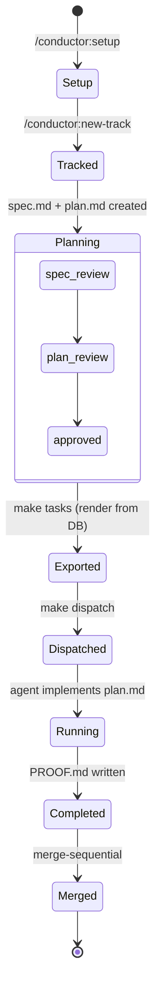
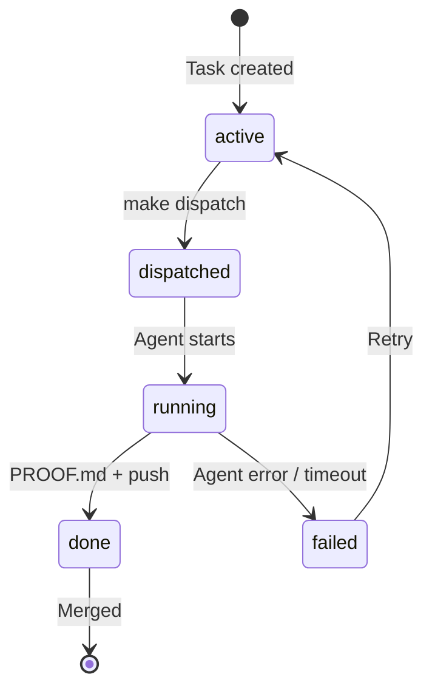

# Data Flow — Task Lifecycle

> How tasks flow through the system from creation to completion.

## End-to-End Pipeline

```mermaid
sequenceDiagram
    participant P as Planner (Conductor / Human / GitHub)
    participant DB as Task Database (SQLite)
    participant TF as TASKS.md
    participant D as Dispatcher (worktree.sh)
    participant A as Agent (Claude / Gemini / Codex)
    participant M as Monitor (monitor_agents.py)
    participant MS as Merge Safety

    rect rgb(30, 60, 90)
    Note over P,TF: 1. PLAN
    P->>DB: Create task (with context pointer)
    DB->>TF: Render TASKS.md (make tasks)
    P->>TF: Or write TASKS.md directly
    TF->>DB: Import (make task-import)
    end

    rect rgb(30, 90, 60)
    Note over D,A: 2. DISPATCH
    DB->>D: Query Active tasks
    D->>D: git worktree add .trees/<branch>
    D->>D: Copy .env, CLAUDE.md, write WORKTREE.md
    D->>A: Launch agent in tmux
    DB->>DB: status: active → dispatched
    end

    rect rgb(90, 60, 30)
    Note over A,M: 3. IMPLEMENT
    A->>A: Read WORKTREE.md → TASKS.md
    A->>A: Resolve Context: pointer (implement-task skill)
    A->>A: Implement task
    A->>A: Run verification
    A->>A: Write PROOF.md
    A->>A: git push branch
    end

    rect rgb(60, 30, 90)
    Note over M,MS: 4. COMPLETE
    M->>M: Detect agent exit (tmux pane dead)
    M->>DB: status: dispatched → done
    M->>M: Post PROOF.md to GitHub Issue
    M->>M: Send ntfy notification
    MS->>MS: check-conflicts
    MS->>MS: validate-worktrees
    MS->>MS: merge-sequential
    end
```



## Context Resolution



## Conductor Track Lifecycle



## Task Status Flow



## Database Write Concurrency

SQLite with WAL mode supports concurrent reads from multiple processes:

```
Writer 1 (conductor) ──write──> [WAL log] ──checkpoint──> [DB file]
Reader 1 (webapp)    ──read───> [DB file] + [WAL log]
Reader 2 (orchestrator) ──read───> [DB file] + [WAL log]
Writer 2 (monitor)   ──write──> [WAL log] (queued behind Writer 1)
```

Multiple repos share the same DB (`~/.tenai/tenai.db`), filtered by `repo` column.

## File Artifacts Map

```
~/.tenai/
└── tenai.db              ← SQLite: orgs, repos, devices, jobs, tasks, subtasks

<repo>/
├── TASKS.md              ← Ephemeral view rendered from DB by orchestrator
├── FAILED_TASKS.md       ← Failed tasks (rendered on failure, dispatch with FAILED=1)
├── conductor/            ← Conductor context (created by /conductor:setup)
│   ├── product.md
│   ├── tech-stack.md
│   ├── workflow.md
│   ├── tracks.md
│   └── tracks/
│       └── <track-id>/
│           ├── spec.md
│           ├── plan.md
│           └── metadata.json
├── CLAUDE.md / GEMINI.md / AGENTS.md  ← Agent instruction files
├── .claude/commands/     ← Claude skills (validate-tasks, proof-of-work, implement-task)
├── .gemini/skills/       ← Gemini skills
├── .codex/skills/        ← Codex skills
└── .trees/               ← Git worktrees (one per dispatched agent)
    └── <branch>/
        ├── WORKTREE.md   ← Task context for this agent
        ├── .session_start← Session metadata (Gastown)
        └── PROOF.md      ← Agent output (test results, walkthrough)
```

## Limitations & Known Constraints

### Worktree Shared `.git` Directory
Git worktrees share the parent repo's `.git` directory.
Key constraint: **two worktrees cannot checkout the exact same branch simultaneously**.

In practice this is **not a problem** for dispatches because:
- Each task branches to a **unique work branch** (e.g. `feat/auth-tests`)
- `base_branch` is only the starting point — `git worktree add -b {work_branch} {dir} origin/{base_branch}`
- Multiple worktrees can branch from the same `base_branch` as long as each has a unique work branch name

Other notes:
- **Concurrent DB writes** use SQLite WAL mode, but heavy parallel writes may cause
  `SQLITE_BUSY`. The system uses short transactions to minimize this.
- **Worktree cleanup**: the dispatch always runs `git worktree prune` before creating
  new worktrees to clean up stale entries from deleted directories.

### `base_branch` Field
Each task has a `base_branch` field (default from org's `default_branch` setting,
fallback `'main'`) specifying which branch to branch *from* when creating the worktree.
The dispatch command will:
1. `git fetch origin` to get latest
2. Try `git worktree add .trees/<branch> origin/<base_branch>` first
3. Fall back to local `<base_branch>` if remote ref doesn't exist
