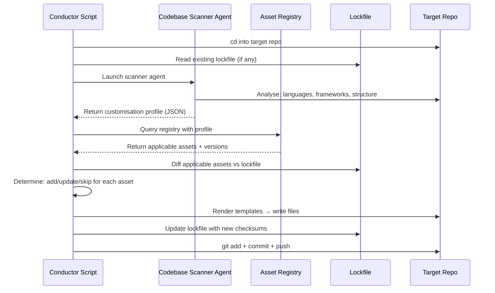

# Agent Asset Injection System — Vision & Expanded Intent

> **Status:** Design draft — not yet implemented.
> **Author:** Conductor planning phase.
> **Date:** 2026-03-11

## Problem Statement

When a repository is checked out for work in a **conductor tmux session**, there is no automated mechanism to:

1. **Inject or update** AI-agent instruction files (`AGENTS.md`, `GEMINI.md`, `CLAUDE.md`, `.github/copilot-instructions.md`, etc.)
2. **Provision** a curated subset of **skills**, **sub-agents**, **commands**, **workflows**, **pre/post hooks**, **policies**, and **GitHub Action CI** definitions appropriate to that specific repository.
3. **Customise** these assets based on codebase analysis (language, framework, structure, existing config).
4. **Track modification history** so subsequent runs remain idempotent and never duplicate or corrupt existing assets.

Currently, `GEMINI.md` and `CLAUDE.md` are hand-written per-repo. Skills, hooks, and sub-agents are not provisioned at all.

---

## Desired End State

```
┌────────────────────────────────────────────────────────────────────┐
│                  tenai-infra (this repo)                          │
│                                                                    │
│  asset-registry/           ← Central database of assets           │
│    registry.yaml           ← Master manifest of all assets        │
│    instructions/           ← AGENTS.md / CLAUDE.md / GEMINI.md    │
│    skills/                 ← Portable skill definitions           │
│    agents/                 ← Sub-agent definitions                │
│    commands/               ← Slash-command definitions            │
│    workflows/              ← Workflow templates                   │
│    hooks/                  ← Pre/post hook definitions            │
│    policies/               ← Conductor/agent policies             │
│    ci-templates/           ← GitHub Actions / CI templates        │
│    rules/                  ← Custom .claude/rules, .gemini/rules  │
│                                                                    │
│  scripts/conductor/                                                │
│    inject_assets.sh        ← Pre-hook called before session start │
│    agent_codebase_scan.py  ← Agent that analyses target repo      │
│                                                                    │
│  config/defaults.yaml      ← asset_injection config section       │
└────────────────────────────────────────────────────────────────────┘
          │
          │  Pre-hook at conductor session start
          ▼
┌────────────────────────────────────────────────────────────────────┐
│              Target Repository (e.g. firecherry-core)             │
│                                                                    │
│  AGENTS.md          ← Injected / updated (high-level rules)      │
│  GEMINI.md          ← Injected / updated                         │
│  CLAUDE.md          ← Injected / updated                         │
│  .github/                                                          │
│    copilot-instructions.md  ← Injected / updated                 │
│    workflows/ci.yml         ← Injected if missing                │
│  .claude/                                                          │
│    skills/deploy/SKILL.md   ← Injected subset                    │
│    agents/reviewer.md       ← Injected subset                    │
│    settings.json            ← Hooks injected                     │
│  .gemini/                                                          │
│    settings.json            ← Policies injected                  │
│  .tenai-assets.lock.yaml   ← Idempotency ledger                 │
└────────────────────────────────────────────────────────────────────┘
```

---

## Core Concepts

### 1. Asset Registry (the "database")

A structured directory in `tenai-infra` that holds **all** reusable agent assets as templates. Each asset has:

| Field | Description |
|-------|-------------|
| `id` | Unique identifier (e.g. `skill/deploy`, `instruction/claude-base`) |
| `type` | `instruction`, `skill`, `agent`, `command`, `workflow`, `hook`, `policy`, `ci-template`, `rule` |
| `target_agent` | `claude`, `gemini`, `copilot`, `all` |
| `applicability` | Conditions for when this asset applies (language, framework, etc.) |
| `version` | Semantic version for change tracking |
| `content_path` | Relative path to the asset template file |
| `instruction_ref` | Which high-level instruction sections reference this asset |

### 2. Instruction Hierarchy

```
AGENTS.md (top-level, agent-agnostic rules)
  ├── CLAUDE.md   (Claude-specific rules + skill/agent references)
  ├── GEMINI.md   (Gemini-specific rules + policy/command references)
  └── .github/copilot-instructions.md  (Copilot-specific)
```

The instructions are **composed** from building blocks:
- **Base template** — universal rules (idempotency, cross-platform, etc.)
- **Project-specific stanza** — auto-generated from codebase scan (structure table, key commands)
- **Asset references** — "You have access to the `/deploy` skill…" etc.

### 3. Codebase Scanner Agent

An AI agent (invoked via Claude Code or Gemini CLI) that:
1. Scans the target repository to determine: languages, frameworks, build tool, test runner, directory structure, existing agent files
2. Produces a **customisation profile** (JSON/YAML) with parameters:
   - `language: python`, `framework: fastapi`, `build: make`, `test: pytest`
   - `has_docker: true`, `has_ci: false`, `has_agent_files: [CLAUDE.md]`
3. This profile drives which assets get injected and how templates get rendered

### 4. Idempotency Ledger

A lockfile (`.tenai-assets.lock.yaml`) committed into the target repo that records:

```yaml
tenai_assets:
  schema_version: 1
  last_applied: "2026-03-11T04:00:00Z"
  applied_by: "tenai-infra@v0.1.0"
  assets:
    - id: instruction/claude-base
      version: "1.2.0"
      sha256: "abc123..."
      applied_at: "2026-03-11T04:00:00Z"
    - id: skill/deploy
      version: "1.0.0"
      sha256: "def456..."
      applied_at: "2026-03-11T04:00:00Z"
```

On subsequent runs, the injector:
1. Compares registry versions against ledger versions
2. Skips assets that are already at the correct version + checksum
3. Updates assets where the version has changed
4. Adds new assets that are now applicable
5. **Never removes** assets the user may have customised (unless `--force`)

### 5. Pre-Hook Integration

The injection script is called as a **pre-hook** in the conductor session start flow:

```
gemini_session.sh → start_conductor()
  ├── ensure_gemini_md()          ← REPLACED by inject_assets.sh
  ├── ensure_tasks_md()           ← kept
  ├── inject_assets.sh            ← NEW: the main entrypoint
  │     ├── scan codebase (or use cached profile)
  │     ├── resolve applicable assets from registry
  │     ├── diff against .tenai-assets.lock.yaml
  │     ├── render templates → inject/update files
  │     ├── update lockfile
  │     ├── git add + commit (if changes)
  │     └── git push (optional, configurable)
  └── start tmux session
```

---

## Asset Type Details

### Instructions (`instruction/`)

| Asset ID | Maps To | Description |
|----------|---------|-------------|
| `instruction/agents-base` | `AGENTS.md` | Agent-agnostic high-level rules |
| `instruction/claude-base` | `CLAUDE.md` | Claude Code project setup |
| `instruction/gemini-base` | `GEMINI.md` | Gemini CLI project setup |
| `instruction/copilot-base` | `.github/copilot-instructions.md` | Copilot instructions |

Each instruction is a **Jinja2**-style template with slots for:
- `{{ project_name }}`, `{{ project_description }}`
- `{{ structure_table }}` — auto-generated directory listing
- `{{ key_rules }}` — composed from applicable rules
- `{{ skill_references }}` — generated from injected skills
- `{{ key_commands }}` — from Makefile / package.json analysis

### Skills (`skill/`)

Following the [Agent Skills specification](https://github.com/anthropics/skills) format:

```
skill/deploy/
  SKILL.md              ← Main instructions with frontmatter
  scripts/deploy.sh     ← Supporting script
  examples/usage.md     ← Example usage

skill/code-review/
  SKILL.md
  scripts/review.sh

skill/test-runner/
  SKILL.md
```

Skills are installed to `.claude/skills/` and/or `.github/skills/` depending on `target_agent`. Cross-agent skills use symlinks (following microsoft/skills pattern).

### Sub-Agents (`agent/`)

Following [Claude Code sub-agents](https://code.claude.com/docs/en/sub-agents) format:

```yaml
# agent/code-reviewer.md
---
name: code-reviewer
description: Reviews code for quality and best practices
tools: Read, Glob, Grep
model: sonnet
---
You are a code reviewer. Analyze code and provide actionable feedback.
```

Installed to `.claude/agents/` or `.gemini/agents/`.

### Hooks (`hook/`)

Following [Claude Code hooks](https://code.claude.com/docs/en/hooks-guide) format:

```json
{
  "type": "command",
  "event": "PostToolUse",
  "matcher": { "tool_name": "Write" },
  "command": "prettier --write $FILE_PATH"
}
```

### Policies (`policy/`)

Following [Gemini conductor policies](https://github.com/gemini-cli-extensions/conductor) format:

```toml
[[rule]]
toolName = ["write_file", "replace"]
decision = "ask_user"
modes = ["plan"]
```

### Workflows (`workflow/`)

Markdown workflow templates similar to `.agents/workflows/*.md`:

```markdown
---
description: How to deploy the application
---
1. Run tests: `make test`
2. Build: `make build`
3. Deploy: `make deploy`
```

### CI Templates (`ci-template/`)

GitHub Actions workflow files:

```yaml
# ci-template/basic-ci.yml
name: CI
on: [push, pull_request]
jobs:
  test:
    runs-on: ubuntu-latest
    steps: ...
```

### Rules (`rule/`)

Context-specific rules that go into `.claude/rules/` or equivalent:

```markdown
# rule/no-hardcoded-secrets.md
Never commit secrets, API keys, or passwords to the repository.
Use environment variables or a .env file instead.
```

---

## Customisation Flow (Detailed)



---

## Configuration (in `config/defaults.yaml`)

```yaml
asset_injection:
  enabled: true
  registry_dir: "asset-registry"
  auto_commit: true
  auto_push: false
  scan_agent: "claude"
  scan_cache_ttl_hours: 24
  default_assets:
    - instruction/agents-base
    - instruction/claude-base
    - instruction/gemini-base
  skip_assets: []
  target_agents:
    - claude
    - gemini
    - copilot
```

---

## Relationship to Existing Ecosystem

| Ecosystem | How We Relate |
|-----------|--------------|
| [anthropics/skills](https://github.com/anthropics/skills) | We can **import** skills from this repo into our registry. Our registry wraps them with applicability conditions and instruction references. |
| [microsoft/skills](https://github.com/microsoft/skills) | Same — import and cross-link. Their `npx skills add` pattern is inspiration for our CLI. |
| [gemini-cli-extensions/conductor](https://github.com/gemini-cli-extensions/conductor) | Our conductor extends this pattern. Their policies, commands, and workflow templates inform our asset types. |
| [skills.sh (Vercel)](https://vercel.com/changelog/introducing-skills-the-open-agent-skills-ecosystem) | Similar vision — open ecosystem of skills. We differ by adding **instruction-level customisation** paired with skill injection. |
| Claude Code hooks/sub-agents | Native format we target. Our hooks and agents are in Claude Code's expected format. |

---

## Key Design Principles

1. **Idempotent**: Running injection twice produces the same result. The lockfile prevents duplicate work.
2. **Additive-only by default**: Never delete user-modified files. Only add or update tracked assets.
3. **Template-driven**: Instructions and assets are templates rendered with repo-specific context.
4. **Agent-aware**: Each asset knows which agent(s) it targets, placed in the correct directory.
5. **Composable**: Skills and instructions reference each other. Adding a skill auto-updates instruction files.
6. **Versioned**: Every asset has a version. The ledger tracks what's deployed where.
7. **Configurable**: Per-repo overrides via config and skip-lists.
8. **Extensible**: New asset types can be added without changing the injection engine.
