# Agent Asset Injection System — Architecture

## Component Map

```mermaid
graph TB
    subgraph "tenai-infra repo"
        REG["asset-registry/"]
        MANIFEST["registry.yaml"]
        TEMPLATES["templates/<br/>instructions, skills, agents..."]
        INJECT["scripts/conductor/inject_assets.sh"]
        SCANNER["scripts/conductor/codebase_scanner.py"]
        CONFIG["config/defaults.yaml<br/>(asset_injection section)"]
    end

    subgraph "Target Repo (checked out)"
        LOCK[".tenai-assets.lock.yaml"]
        AGENTS_MD["AGENTS.md"]
        CLAUDE_MD["CLAUDE.md"]
        GEMINI_MD["GEMINI.md"]
        CLAUDE_DIR[".claude/<br/>skills/, agents/, rules/"]
        GEMINI_DIR[".gemini/<br/>settings.json"]
        GH_DIR[".github/<br/>workflows/, copilot-instructions.md"]
        AGENT_WF[".agents/workflows/"]
    end

    subgraph "External (optional)"
        ANTHRO["anthropics/skills repo"]
        MSFT["microsoft/skills repo"]
        COND["gemini-cli-extensions/conductor"]
    end

    CONFIG --> INJECT
    INJECT --> SCANNER
    SCANNER -->|"profile.json"| INJECT
    INJECT --> MANIFEST
    MANIFEST --> TEMPLATES
    INJECT -->|"read"| LOCK
    INJECT -->|"render + write"| AGENTS_MD
    INJECT -->|"render + write"| CLAUDE_MD
    INJECT -->|"render + write"| GEMINI_MD
    INJECT -->|"copy + write"| CLAUDE_DIR
    INJECT -->|"copy + write"| GEMINI_DIR
    INJECT -->|"copy + write"| GH_DIR
    INJECT -->|"copy + write"| AGENT_WF
    INJECT -->|"update"| LOCK

    ANTHRO -.->|"import"| REG
    MSFT -.->|"import"| REG
    COND -.->|"import"| REG
```



---

## Directory Layout (tenai-infra)

```
tenai-infra/
├── asset-registry/
│   ├── registry.yaml                 # Master manifest
│   ├── instructions/
│   │   ├── agents-base.md.j2         # AGENTS.md template
│   │   ├── claude-base.md.j2         # CLAUDE.md template
│   │   ├── gemini-base.md.j2         # GEMINI.md template
│   │   ├── copilot-base.md.j2        # copilot-instructions.md template
│   │   └── partials/
│   │       ├── project-header.md.j2  # Reusable partial: project identity
│   │       ├── structure-table.md.j2 # Reusable partial: directory table
│   │       ├── key-rules.md.j2       # Reusable partial: rules section
│   │       └── skill-refs.md.j2      # Reusable partial: skill references
│   ├── skills/
│   │   ├── deploy/
│   │   │   ├── SKILL.md
│   │   │   └── scripts/deploy.sh
│   │   ├── code-review/
│   │   │   └── SKILL.md
│   │   ├── test-runner/
│   │   │   └── SKILL.md
│   │   └── conductor-workflow/
│   │       └── SKILL.md
│   ├── agents/
│   │   ├── code-reviewer.md
│   │   ├── security-auditor.md
│   │   └── refactorer.md
│   ├── commands/
│   │   ├── conductor/
│   │   │   └── newTrack.toml
│   │   └── status.toml
│   ├── workflows/
│   │   ├── tdd-workflow.md
│   │   ├── deploy-workflow.md
│   │   └── review-workflow.md
│   ├── hooks/
│   │   ├── auto-format.json
│   │   ├── notify-idle.json
│   │   └── protect-config.json
│   ├── policies/
│   │   ├── conductor.toml
│   │   └── plan-mode.toml
│   ├── ci-templates/
│   │   ├── python-ci.yml
│   │   ├── node-ci.yml
│   │   └── generic-ci.yml
│   └── rules/
│       ├── no-hardcoded-secrets.md
│       ├── idempotent-scripts.md
│       └── test-before-commit.md
│
├── scripts/conductor/
│   ├── gemini_session.sh             # Modified: calls inject_assets.sh
│   ├── inject_assets.sh              # NEW: main injection entrypoint
│   ├── codebase_scanner.py           # NEW: AI-powered codebase analyser
│   ├── template_renderer.py          # NEW: Jinja2 template rendering
│   └── ledger.py                     # NEW: lockfile read/write/diff
│
├── config/
│   └── defaults.yaml                 # Extended with asset_injection config
│
└── todo/                             # This planning directory
```

---

## Registry Schema (`registry.yaml`)

```yaml
schema_version: 1

assets:
  # ── Instructions ──
  - id: instruction/agents-base
    type: instruction
    target_agent: all
    version: "1.0.0"
    content_path: instructions/agents-base.md.j2
    target_path: AGENTS.md
    description: "Agent-agnostic high-level rules"
    applicability:
      always: true

  - id: instruction/claude-base
    type: instruction
    target_agent: claude
    version: "1.0.0"
    content_path: instructions/claude-base.md.j2
    target_path: CLAUDE.md
    description: "Claude Code project instructions"
    applicability:
      always: true

  - id: instruction/gemini-base
    type: instruction
    target_agent: gemini
    version: "1.0.0"
    content_path: instructions/gemini-base.md.j2
    target_path: GEMINI.md
    description: "Gemini CLI project instructions"
    applicability:
      always: true

  # ── Skills ──
  - id: skill/deploy
    type: skill
    target_agent: claude
    version: "1.0.0"
    content_path: skills/deploy/
    target_path: .claude/skills/deploy/
    description: "Deployment skill with CI integration"
    instruction_ref: "instruction/claude-base#skills"
    applicability:
      has_file: [Makefile, Dockerfile, docker-compose.yml]

  - id: skill/code-review
    type: skill
    target_agent: claude
    version: "1.0.0"
    content_path: skills/code-review/
    target_path: .claude/skills/code-review/
    description: "Automated code review skill"
    instruction_ref: "instruction/claude-base#skills"
    applicability:
      always: true

  - id: skill/test-runner
    type: skill
    target_agent: claude
    version: "1.0.0"
    content_path: skills/test-runner/
    target_path: .claude/skills/test-runner/
    description: "Test discovery and execution"
    instruction_ref: "instruction/claude-base#skills"
    applicability:
      has_file: [pytest.ini, setup.cfg, package.json, Cargo.toml]

  # ── Sub-Agents ──
  - id: agent/code-reviewer
    type: agent
    target_agent: claude
    version: "1.0.0"
    content_path: agents/code-reviewer.md
    target_path: .claude/agents/code-reviewer.md
    description: "Code review sub-agent"
    instruction_ref: "instruction/claude-base#agents"
    applicability:
      always: true

  # ── Hooks ──
  - id: hook/auto-format
    type: hook
    target_agent: claude
    version: "1.0.0"
    content_path: hooks/auto-format.json
    target_path: .claude/settings.json#hooks
    description: "Auto-format on file write"
    instruction_ref: "instruction/claude-base#hooks"
    applicability:
      has_file: [.prettierrc, pyproject.toml, rustfmt.toml]

  # ── Policies ──
  - id: policy/conductor
    type: policy
    target_agent: gemini
    version: "1.0.0"
    content_path: policies/conductor.toml
    target_path: .gemini/policies/conductor.toml
    description: "Conductor plan-mode policies"
    applicability:
      always: true

  # ── CI Templates ──
  - id: ci-template/python-ci
    type: ci-template
    target_agent: all
    version: "1.0.0"
    content_path: ci-templates/python-ci.yml
    target_path: .github/workflows/ci.yml
    description: "Python CI with pytest + ruff"
    applicability:
      language: python
      missing_file: .github/workflows/ci.yml

  # ── Workflows ──
  - id: workflow/tdd
    type: workflow
    target_agent: all
    version: "1.0.0"
    content_path: workflows/tdd-workflow.md
    target_path: .agents/workflows/tdd.md
    description: "TDD workflow template"
    applicability:
      always: true

  # ── Rules ──
  - id: rule/no-secrets
    type: rule
    target_agent: claude
    version: "1.0.0"
    content_path: rules/no-hardcoded-secrets.md
    target_path: .claude/rules/no-hardcoded-secrets.md
    description: "Prevent hardcoded secrets"
    applicability:
      always: true
```

---

## Codebase Scanner Output Schema

```yaml
# Generated by codebase_scanner.py or AI agent
scan_profile:
  scanned_at: "2026-03-11T04:00:00Z"
  repo_name: "firecherry-core"
  repo_root: "/home/ubuntu/tenai-projects/firecherry-core"

  # Language detection
  languages:
    - name: python
      percentage: 72.3
      primary: true
    - name: javascript
      percentage: 18.1

  # Framework detection
  frameworks:
    - fastapi
    - react

  # Build / package detection
  build_tool: make        # make | npm | cargo | gradle | none
  package_manager: uv     # pip | uv | npm | yarn | cargo | none
  test_runner: pytest      # pytest | jest | cargo-test | none

  # Structure
  directories:
    - src/
    - tests/
    - webapp/
    - docs/

  # Existing agent files
  existing_agent_files:
    - CLAUDE.md
    - GEMINI.md

  # Key files present
  has_files:
    Makefile: true
    Dockerfile: true
    docker-compose.yml: true
    pyproject.toml: true
    package.json: false
    .github/workflows/ci.yml: false
    .prettierrc: false
```

---

## Injection Algorithm

```python
def inject_assets(target_repo, registry, config):
    # 1. Read or generate scan profile
    profile = load_or_scan(target_repo, config.scan_cache_ttl_hours)

    # 2. Read existing lockfile
    lockfile = read_lockfile(target_repo / ".tenai-assets.lock.yaml")

    # 3. Resolve applicable assets
    applicable = []
    for asset in registry.assets:
        if asset.id in config.skip_assets:
            continue
        if matches_applicability(asset.applicability, profile):
            applicable.append(asset)

    # 4. Determine actions
    actions = []
    for asset in applicable:
        locked = lockfile.get(asset.id)
        if locked is None:
            actions.append(Action("ADD", asset))
        elif locked.version != asset.version:
            actions.append(Action("UPDATE", asset))
        elif locked.sha256 != hash_asset(asset):
            actions.append(Action("UPDATE", asset))
        else:
            actions.append(Action("SKIP", asset))

    # 5. Execute actions
    for action in actions:
        if action.type == "SKIP":
            continue
        if action.asset.type == "instruction":
            rendered = render_template(action.asset, profile, applicable)
            write_file(target_repo / action.asset.target_path, rendered)
        else:
            copy_asset(action.asset, target_repo)

    # 6. Update lockfile
    update_lockfile(target_repo, applicable, actions)

    # 7. Commit if configured
    if config.auto_commit and has_changes(target_repo):
        git_commit(target_repo, "chore(tenai): inject/update agent assets")
        if config.auto_push:
            git_push(target_repo)
```
