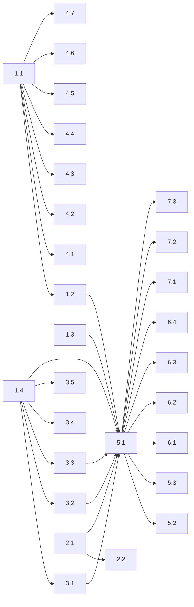

# Agent Asset Injection System — Task Breakdown

> This document serves as the **TASKS.md generator input**. Each top-level section is a self-contained, verifiable, bounded, parallelisable, resume-safe task ready for agent dispatch.

---

## Phase 1: Foundation (sequential — builds the base)

### Task 1.1: Create Asset Registry Directory Structure
- **Goal:** Create the `asset-registry/` directory tree with empty placeholder files
- **Files:** `asset-registry/{registry.yaml, instructions/, skills/, agents/, commands/, workflows/, hooks/, policies/, ci-templates/, rules/}`
- **Verify:** `find asset-registry -type f | wc -l` returns expected count; `registry.yaml` passes YAML lint
- **Bounded:** < 30 min
- **Depends on:** Nothing

### Task 1.2: Design and Write `registry.yaml` Schema
- **Goal:** Populate `asset-registry/registry.yaml` with the full manifest schema (all asset entries, applicability rules, version fields)
- **Reference:** `todo/01_ARCHITECTURE.md` → Registry Schema section
- **Verify:** `python -c "import yaml; yaml.safe_load(open('asset-registry/registry.yaml'))"` succeeds; schema validates against a JSON Schema definition
- **Bounded:** < 1 hour
- **Depends on:** 1.1

### Task 1.3: Write Idempotency Ledger Module (`ledger.py`)
- **Goal:** Create `scripts/conductor/ledger.py` — Python module that reads/writes/diffs `.tenai-assets.lock.yaml`
- **Functions:** `read_lockfile()`, `update_lockfile()`, `diff_assets()`, `hash_content()`
- **Verify:** Unit tests: read empty, read existing, diff add/update/skip, hash consistency
- **Bounded:** < 1 hour
- **Depends on:** Nothing

### Task 1.4: Write Template Renderer (`template_renderer.py`)
- **Goal:** Create `scripts/conductor/template_renderer.py` — Jinja2-based renderer for instruction templates
- **Functions:** `render_template(template_path, profile, assets)`, `render_partial(partial_name, context)`
- **Verify:** Unit tests: render base template, render with partials, render with skill references, handle missing vars
- **Bounded:** < 1 hour
- **Depends on:** Nothing

---

## Phase 2: Codebase Scanner (parallelisable with Phase 1 tasks)

### Task 2.1: Write Codebase Scanner Script (`codebase_scanner.py`)
- **Goal:** Create `scripts/conductor/codebase_scanner.py` that analyses a target repo and produces a `scan_profile` YAML/JSON
- **Detection targets:** Languages (file extensions), frameworks (imports/config), build tools, package managers, test runners, existing agent files, key file presence
- **Reference:** `todo/01_ARCHITECTURE.md` → Scanner Output Schema
- **Verify:** Run against `tenai-infra` itself and 2+ other repos; validate output matches expected profile
- **Bounded:** < 2 hours
- **Depends on:** Nothing

### Task 2.2: AI-Enhanced Scanner Mode (optional)
- **Goal:** Add an optional mode to `codebase_scanner.py` that invokes Claude/Gemini to produce richer analysis (project description, coding conventions, recommended skills)
- **Verify:** Compare AI-enhanced profile vs basic profile; AI output is valid YAML
- **Bounded:** < 2 hours
- **Depends on:** 2.1

---

## Phase 3: Instruction Templates

### Task 3.1: Create `AGENTS.md` Template
- **Goal:** Write `asset-registry/instructions/agents-base.md.j2` — agent-agnostic instruction template
- **Includes:** Project identity, architecture overview, key rules, key commands, documentation conventions, do-not-do list
- **Template vars:** `{{ project_name }}`, `{{ project_description }}`, `{{ structure_table }}`, `{{ key_rules }}`, `{{ key_commands }}`
- **Verify:** Render against `tenai-infra` scan profile; output is valid, readable markdown
- **Bounded:** < 1 hour
- **Depends on:** 1.4 (renderer exists)

### Task 3.2: Create `CLAUDE.md` Template
- **Goal:** Write `asset-registry/instructions/claude-base.md.j2` — Claude Code specific template
- **Includes:** All of AGENTS.md content + Claude-specific sections: skills reference, sub-agents reference, hooks reference, rules reference
- **Verify:** Render with skills injected; output includes valid skill `/command` references
- **Bounded:** < 1 hour
- **Depends on:** 1.4

### Task 3.3: Create `GEMINI.md` Template
- **Goal:** Write `asset-registry/instructions/gemini-base.md.j2` — Gemini CLI specific template
- **Includes:** All of AGENTS.md content + Gemini-specific sections: conductor role, policy references, command references
- **Verify:** Render output matches current hand-written `GEMINI.md` structure
- **Bounded:** < 1 hour
- **Depends on:** 1.4

### Task 3.4: Create Copilot Instructions Template
- **Goal:** Write `asset-registry/instructions/copilot-base.md.j2`
- **Verify:** Render output is valid `.github/copilot-instructions.md`
- **Bounded:** < 30 min
- **Depends on:** 1.4

### Task 3.5: Create Reusable Partials
- **Goal:** Write partial templates in `asset-registry/instructions/partials/`:
  - `project-header.md.j2`, `structure-table.md.j2`, `key-rules.md.j2`, `skill-refs.md.j2`
- **Verify:** Each partial renders independently; included by main templates
- **Bounded:** < 1 hour
- **Depends on:** 1.4

---

## Phase 4: Asset Content Creation

### Task 4.1: Write Core Skills
- **Goal:** Create 3-5 core skills in `asset-registry/skills/`:
  - `deploy/` — deployment automation
  - `code-review/` — code quality review
  - `test-runner/` — test discovery and execution
  - `conductor-workflow/` — conductor task management
- **Format:** Each has `SKILL.md` with frontmatter per Claude Code spec
- **Verify:** Each SKILL.md has valid frontmatter; skill directories are complete
- **Bounded:** < 2 hours
- **Depends on:** 1.1

### Task 4.2: Write Core Sub-Agents
- **Goal:** Create 2-3 sub-agent definitions in `asset-registry/agents/`:
  - `code-reviewer.md` — review agent
  - `security-auditor.md` — security scanning agent
  - `refactorer.md` — code improvement agent
- **Format:** Markdown with frontmatter per Claude Code sub-agents spec
- **Verify:** Valid frontmatter; each has `name`, `description`, `tools`, `model`
- **Bounded:** < 1 hour
- **Depends on:** 1.1

### Task 4.3: Write Core Hooks
- **Goal:** Create 2-3 hook definitions in `asset-registry/hooks/`:
  - `auto-format.json` — format on write
  - `notify-idle.json` — notification when agent needs input
  - `protect-config.json` — block edits to critical files
- **Format:** JSON matching Claude Code hooks schema
- **Verify:** JSON lint passes; matches Claude Code hook event types
- **Bounded:** < 1 hour
- **Depends on:** 1.1

### Task 4.4: Write Core Policies
- **Goal:** Create policies in `asset-registry/policies/`:
  - `conductor.toml` — plan-mode safety policies
  - `plan-mode.toml` — read-only mode policies
- **Format:** TOML matching Gemini CLI policy format
- **Verify:** TOML lint; matches conductor policy schema
- **Bounded:** < 30 min
- **Depends on:** 1.1

### Task 4.5: Write Workflow Templates
- **Goal:** Create workflow templates in `asset-registry/workflows/`:
  - `tdd-workflow.md`, `deploy-workflow.md`, `review-workflow.md`
- **Format:** Markdown with YAML frontmatter matching `.agents/workflows/` format
- **Verify:** Valid frontmatter; steps are actionable
- **Bounded:** < 1 hour
- **Depends on:** 1.1

### Task 4.6: Write CI Templates
- **Goal:** Create CI templates in `asset-registry/ci-templates/`:
  - `python-ci.yml`, `node-ci.yml`, `generic-ci.yml`
- **Verify:** `actionlint` passes on each template
- **Bounded:** < 1 hour
- **Depends on:** 1.1

### Task 4.7: Write Core Rules
- **Goal:** Create rule files in `asset-registry/rules/`:
  - `no-hardcoded-secrets.md`, `idempotent-scripts.md`, `test-before-commit.md`
- **Format:** Markdown for `.claude/rules/` directory
- **Verify:** Readable, concise, actionable rules
- **Bounded:** < 30 min
- **Depends on:** 1.1

---

## Phase 5: Injection Engine

### Task 5.1: Write `inject_assets.sh` Main Script
- **Goal:** Create `scripts/conductor/inject_assets.sh` — the main pre-hook entry point
- **Flow:**
  1. Accept `REPO_DIR` argument
  2. Run `codebase_scanner.py` (or use cache)
  3. Load `registry.yaml` and filter by applicability
  4. Call `ledger.py` to diff against lockfile
  5. Call `template_renderer.py` for instructions
  6. Copy asset files for skills/agents/hooks/etc.
  7. Update lockfile
  8. Git add + commit (if `auto_commit`)
  9. Git push (if `auto_push`)
- **Verify:** Run against a test repo (clone a scratch repo); verify all expected files created; lockfile updated; idempotent on re-run
- **Bounded:** < 2 hours
- **Depends on:** 1.2, 1.3, 1.4, 2.1

### Task 5.2: Integrate into `gemini_session.sh`
- **Goal:** Modify `scripts/conductor/gemini_session.sh` to call `inject_assets.sh` in `start_conductor()` replacing `ensure_gemini_md()`
- **Verify:** `make conductor` with a test repo triggers injection; existing behavior preserved
- **Bounded:** < 30 min
- **Depends on:** 5.1

### Task 5.3: Add `asset_injection` Config Section
- **Goal:** Add the `asset_injection` section to `config/defaults.yaml`
- **Verify:** Hydra loads the new config without errors
- **Bounded:** < 30 min
- **Depends on:** Nothing

---

## Phase 6: Testing & Validation

### Task 6.1: Integration Test — Fresh Repo
- **Goal:** Create a test script that clones a fresh repo, runs injection, verifies all expected files exist, lockfile is correct
- **Verify:** Green test; files match expected content
- **Bounded:** < 1 hour
- **Depends on:** 5.1

### Task 6.2: Integration Test — Idempotent Re-run
- **Goal:** Run injection twice on the same repo; verify no duplicate commits, no file changes on second run
- **Verify:** `git log --oneline | wc -l` shows exactly 1 injection commit; `git diff --stat` is empty on second run
- **Bounded:** < 1 hour
- **Depends on:** 6.1

### Task 6.3: Integration Test — Version Upgrade
- **Goal:** Bump a registry asset version, re-run injection; verify only that asset is updated, lockfile reflects new version
- **Verify:** Only changed files appear in diff; lockfile version matches new version
- **Bounded:** < 1 hour
- **Depends on:** 6.1

### Task 6.4: Integration Test — Self-Injection
- **Goal:** Run the system against `tenai-infra` itself; verify it correctly identifies the existing `CLAUDE.md` and `GEMINI.md`, updates them without data loss
- **Verify:** Existing content preserved or improved; no regressions
- **Bounded:** < 1 hour
- **Depends on:** 5.1

---

## Phase 7: Documentation

### Task 7.1: Write `docs/HOWTO_asset_injection.md`
- **Goal:** End-user documentation: how to use, configure, and extend the asset injection system
- **Verify:** Doc is complete and follows project doc naming convention
- **Bounded:** < 1 hour
- **Depends on:** 5.1

### Task 7.2: Write `docs/CONCEPT_asset_registry.md`
- **Goal:** Architecture/concept doc explaining the registry, ledger, and injection flow
- **Verify:** Accurate diagrams; matches implementation
- **Bounded:** < 1 hour
- **Depends on:** 5.1

### Task 7.3: Add Makefile Targets
- **Goal:** Add `make inject-assets`, `make scan-repo`, `make registry-status` targets
- **Verify:** Each target runs without error
- **Bounded:** < 30 min
- **Depends on:** 5.1

---

## Dependency Graph

---

## Parallelisation Plan (for agent dispatch)

| Batch | Tasks | Agents Needed |
|-------|-------|---------------|
| Batch A | 1.1, 1.3, 1.4, 2.1, 5.3 | 5 agents |
| Batch B | 1.2, 3.1-3.5, 4.1-4.7, 2.2 | 5-8 agents (after 1.1 + 1.4 complete) |
| Batch C | 5.1 | 1 agent (after all Phase 1-4 complete) |
| Batch D | 5.2, 6.1-6.4 | 4 agents (after 5.1 complete) |
| Batch E | 7.1-7.3 | 3 agents (after 5.1 complete) |
